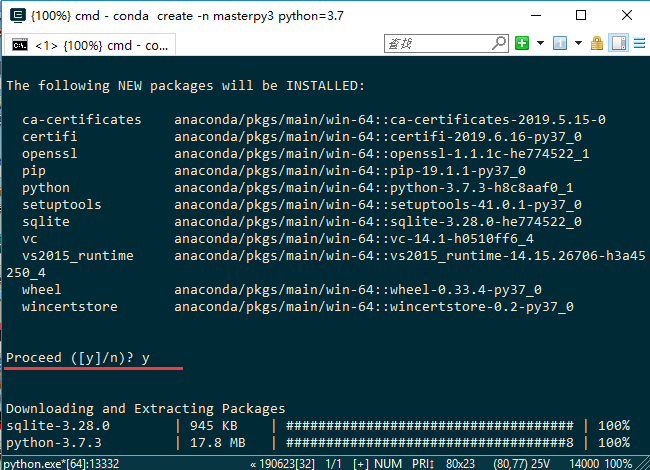
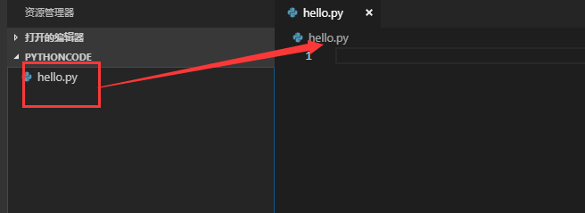
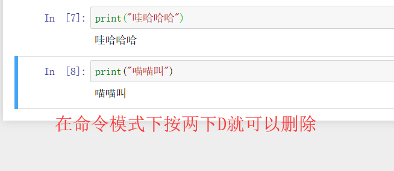

## *工欲善其事*，*必先利其器*

译：工匠想要使他的工作做好，一定要先让工具锋利。

&nbsp;

Author：Masterpaopao

本博客Github地址：https://github.com/Masterpaopao/Relearn-Python

转载请注明原Github出处，谢谢。

## 教学目标

1）快速接触到Python的世界

2）熟练使用各种辅助编程软件

3）学会如何根据需求指定Python版本

4）在今后不同的场景中灵活切换编程方式

## 一.Python

我在README.md里面就写过，本篇教程面向已有Python基础的同学，所以开场白我长话短说。

Python如今是非常火的，因为它拥有着庞大生态圈，更别说两个关键应用圈：机器学习与人工智能

然而我认为，它却不能成为一个程序员的终身方向，因为只学Python是找不到工作的，大家可以看看一些招聘岗位，Python相关的招聘岗位数量并不能与此时Python大热的处境所相符合，你学会了Python，这只是你刚入程序员这一行的开端，更多的是，我认为Python恰恰成为每个程序员都要学会的技能，因为Python程序的编写效率真的很高，维护成本很低，可以作为粘合剂脚本嫁接进去大型应用程序。

好了，让我们现在就进入Python的世界里吧！

首先确定你的电脑是windows，为64系统位数版本，打开Python的官网下载windows的python3.7：

<https://www.python.org/downloads/windows/>


开头的第一个链接就是我们需要的东西，点击去之后往下拉，找到这个


安装完成以后，打开安装界面，千万别着急直接下一步，别忘了勾选这个！

环境变量已经是一个老梗了，多少想自学任何编程语言大部分都倒在这个地方!


然后后面的可以直接Next完成安装，中途有个安装位置的选择，自己看着办吧。

==================================================

当你安装Python完毕以后，我会执行下面的三个步骤，来验证你的Python安装是否有问题。

①打开你系统本地的命令提示符cmd，输入python

如果你出现这样的画面，则说明你的Python安装成功了一大半


②打开启动菜单栏，会发现有个叫IDLE(Python3.7 64-bit)，点击启动


启动以后，你会出来这样的默认Python命令行界面窗口


这样也同样能说明你的Python程序没有任何问题。

③编写你的第一个Python程序，正式踏入编程之途

在IDLE中，点击左上角的File，选择New File


在新弹出来的窗口中，输入以下的代码：

```python
print("Hello world!")
```

输入完成以后，按下ctrl+s，取个名字之后直接保存到桌面上（方便等下删除），然后点击运行


不出意外的话，你的第一个Python程序成功了，在你的IDLE界面显示结果。


==================================================

OK，以上只是帮助你快速了解Python的一个过程，如果你哪个地方遇到问题了，请你学会使用百度和CSDN途径去解决问题，程序员第一要素就是能解决问题的能力。

如果你遇到的是安装问题，请检查你的系统版本信息；

如果你遇到的是cmd打不开python的问题，恭喜你，你没有认真看我的博客，还是环境变量的老梗问题；

如果你的Python代码遇到报错，请反思一下你是不是使用了中文符号，代码的世界里面符号只有英文版的。

&nbsp;

现在，激动人心的时候来了。

我会告诉你，上面的这些东西我们都不会用到，你会不会打我？

因为接下来，我将带你搭建更全面更专业的Python编程环境，从上面的教学目标你也看得出来，我们将会由多种编程方式，根据场景的需求来灵活切换。

&nbsp;

## 二.Miniconda

在你询问Miniconda是什么之前，我会告诉你Miniconda是Anaconda的迷你轻量版。

那么，Anaconda到底是什么呢？

Anaconda指的是一个开源的Python发行版本，其包含了conda、Python等180多个科学包及其依赖项。简单来说，这个Anaconda专为科学计算而生，里面包含了一些必然会用到的Python科学计算包。最重要的是，Anaconda还是一个开源的包环境管理器，可以用于在同一个机器上安装不同版本的软件包及其依赖，并能够在不同的环境之间切换。

&nbsp;

现在你明白了吗？从今以后我们的编程都将基于在Anaconda的Python环境上面，而不是建立在从官网上面下载的默认Python环境，我们编程应该使用更加强大的工具。

进一步讲，我们不用Anaconda用Miniconda的原因就是，Anaconda的大小有五百多兆，而Miniconda里面只有python和conda，然后我们需要什么就去pip下载，是一个很好的轻量级替代。

所以，我们该去下载Miniconda了，注意，这儿不从官网下载，而是从清华大学镜像站去下载。

（如果你明白官网源是外国服务器，从今以后的下载都会很慢的，那就再好不过了。）

<https://mirrors.tuna.tsinghua.edu.cn/help/anaconda/>

在清华大学镜像站网页里，它给出了Miniconda的下载地址


不过很奇怪的是，下载链接是正序排列的，所以我们只能直接拉到最后面，直接下载我们所需要的版本


安装完成以后，打开安装程序，安装到一个比较合适的地方，比如直接安装到D盘下最好


但是请注意，这个也不能直接Next！因为又遇到了环境变量的老梗！！


然后就等着安装成功吧！这个过程需要一定的时间！

==================================================

当你安装好以后，同样也是打开启动菜单栏里面的Aanconda Prompt，输入conda，你会看到这个


然后关闭这个，这个只是代表安装成功了，我们还需要验证一下环境变量

再打开系统的命令行提示符cmd，输入conda验证环境变量：


当你两个地方输入conda都有反应的时候，这代表你安装Miniconda成功了。

当然了，这个时候你在cmd中再输入python，你会发现此时的Python环境变成了Anaconda的源。


&nbsp;

## 三.ConEmu

ConEmu是什么？

ConEmu是一款免费的DOS系统仿真器，体积小巧，界面清爽，支持多标签操作，兼容dos原有的指令。

说白了，ConEmu就是一个类似于上面所使用的系统命令符cmd一样的存在，没错，我们现在要做的就是告别系统默认的cmd，去使用一种全新的命令符终端软件ConEmu。

为什么呢？首先cmd有最高管理员root权限，如果我们常常去使用，难免会翻车，一不小心破坏系统，更主要的是cmd其实不好用，界面也不好看。转向去使用ConEmu的原因无非是它安全，可以自定义界面，还可以自定义命令缩写，将它用来全心全意地控制Miniconda是最好的选择。

&nbsp;

我们统一将ConEmu简称为cmu，并且今后的学习道路上我们只使用cmu配合miniconda完成python的编程。

<https://www.fosshub.com/ConEmu.html>

打开这个网站以后，选择这个安装ConEmu


然后我们会遇到选择x64还是x86，其实看你的电脑有没有Program Files (x86)这个文件夹就行了，安装x86版本的


然后安装的时候，这个软件并不是强制安装在C盘的，你可以改成D盘就可以了。

==================================================

安装成功以后，打开桌面上的ConEmu，开头会让你配置，你需要修改两个地方再点击OK


改好了之后，你会发现这样的界面，这时候你直接输入conda测试一下，应该是没什么问题的。


==================================================

这儿说一下两个改善启动ConEmu的技巧：

①右键ConEmu，选择固定到任务栏


这样一来，你以后可以快速地从这儿启动ConEmu，开启Python编程。

②输入cmd可以启动系统命令符，为什么不弄一个cmu呢

我这个标题已经说的很清楚了，现在你在菜单输入cmd，在文件夹地址输入cmd，都能出来系统命令符

那么我这个新安装的ConEmu也要达到这个效果，输入cmu也要能启动成功

首先打开你的ConEmu的安装目录，将这个ConEmu.exe右键点击复制粘贴，然后改名为cmu.exe


注意，这个不能使用创建快捷方式的方法！希望你能百度明白创建快捷方式实际上是等于路径重定向的行为。

这样一来，你再在系统菜单栏或者文件夹地址输入cmu，是不是能成功启动ConEmu了？


接下来最关键的一步就是你这个cmu只能在当前文件夹启动，如果我们去别的文件夹就无法启动cmu

这是因为你没有加入到系统环境变量，无法应用到全局系统。

win10的话，直接在菜单栏输入环境变量，应该能看到这个，如果看不到的自己从控制面板找


然后找到下面的系统变量里面的Path，点击编辑


然后复制一下你安装ConEmu的目录路径，新建一个复制进去就可以了


这样一来，我们可以随便找个复杂路径的文件夹进行验证


可以发现，新启动的cmu，里面的默认路径确实随着启动地方的路径而改变


现在，你已经正式配置好ConEmu的使用了，从今以后你就可以用cmu来替代系统默认的cmd终端。

&nbsp;

## 四.Conda

在上面，我们已经搞定了Miniconda+ConEmu的两大工具，我们进一步使用这两个工具，来完成Python环境的搭建。比如我们会创建两个环境，一个是Python3.7，一个是Python2.7。

事实上，在我们安装Miniconda的时候，就有一个环境了，我们在cmu中输入conda env list


发现了吗，这个base就是默认环境，但是它安装在主目录下面，我们如果以后直接使用base环境的话，会遇到环境污染以及许多意想不到的BUG(我在Linux搭建的时候，使用base无法启动jupyter)。

所以，我们今后不使用这个base环境来编程，而是选择创建一个主环境进行长期使用。

==================================================

在使用cmu进行创建与使用环境之前，我们需要更改一下Miniconda的网络源设置

如果不配置网络源，我们今后安装Python的第三方库都是从官网下载，那样速度太慢了，因为是外国服务器。

所以我们需要配置上清华大学镜像站的网络源，就可以像是在国内下载东西一样的速度去安装

直接拷贝下面三局命令放到cmu中：

```
conda config --add channels https://mirrors.tuna.tsinghua.edu.cn/anaconda/pkgs/free/
conda config --add channels https://mirrors.tuna.tsinghua.edu.cn/anaconda/pkgs/main/
conda config --set show_channel_urls yes
```


完成以后，你可以试一试输入pip install numpy感受一下速度是不是很快。

==================================================

现在，网络源我们搞定了，等下创建Python环境的时候是直接从清华镜像源下载的，速度都会非常快。

在干活之前，我们先来感受一下五条命令：

```
conda env list              查看已有的编程虚拟环境
conda create -n $*          创造一个编程虚拟环境
activate $*                 进入环境
conda deactivate            退出环境
conda remove --all -n $*    移除环境
```

你们有没有觉得这五条命令好麻烦，又长又臭？

既然我们知道ConEmu可以自定义命令缩写，为什么不能就发挥一下这个优势呢？

所以我们打开conemu中的settings，或者直接快捷键：Win+Alt+P，找到环境的选项


然后将下面这五句代码直接复制进去：

```
alias cl=conda env list
alias cc=conda create -n $*
alias coa=activate $*
alias cod=conda deactivate
alias cr=conda remove --all -n $*
```

复制进去以后直接保存设置，这些缩写命令就会生效了


现在五个命令的效果是怎么样的？会变成这个样子：

```
cl        查看已创建的环境列表
cc        创造一个虚拟环境
coa       进入环境
cod       退出当前环境
cr        移除环境
```

这五个命令非常好记忆吧？这个时候你需要关闭一下ConEmu，再重启，直接输入cl试试看效果？


==================================================

在上面，我们配置了国内网络源与五个缩写命令之后，我们终于来到了创建编程环境的步骤。

```
cl        查看已创建的环境列表
cc        创造一个虚拟环境
coa       进入环境
cod       退出当前环境
cr        移除环境
```

复习一下这五个自定义的缩写命令，然后确定需求，我们要创建两个环境，一个是Python3.7，一个是Python2.7

先来创建一下Python3.7的编程环境：

输入cc masterpy3 python=3.7，进行安装，中间的masterpy3你们可以任意命名，取个喜欢的名字

在安装的过程中你会遇到提示，直接输入y即可，直到安装完成



安装完成以后，你可以输入cl看看


从今以后，我们的编程环境就使用这个叫做masterpy3的环境，也有可能是一辈子呢~

当然了，我们难免会遇到要使用Python2.7的环境，所以我们正好也安装一个

输入cc masterpy2 python=2.7，安装完成以后输入cl查看即可


==================================================

现在，我们就要使用一下我们所创建的这些环境，输入coa masterpy3


我们这样是不是就进入了masterpy3的环境？

当然了，你如果想要切换到Python2的环境呢，就输入cod推出当前环境，再进入py2环境


当然了，我们毕竟是初学者，而且当前Python的趋势肯定是Python3，我们几乎用不上Python2.7的环境

所以还不如一口气删掉这个多余的环境吧！

输入cr masterpy2，遇到提示就输入y，即可删掉这个环境。最后输入cl看看


从今以后，我们的编程环境就使用masterpy3环境。

&nbsp;

## 五.VsCode

在上面，我们终于搞定了Python版本的切换，现在我们的编程应该落实到一个编辑器了。

而我在这儿推荐的就是VsCode，一种轻量级编辑器，也是我所认为现在最好的Python编辑器。

它现在唯一的缺陷就是只能依赖Miniconda来完成第三方包的安装和Python版本的切换，但是在上面我们已经搞定了这两个缺陷，所以它现在就成了最好用的Python编辑器，至少在我心中是的。

<https://code.visualstudio.com/>

首页就有windows的下载链接，直接点击一路默认安装即可，当然了，也可以改成安装到D盘

安装完成以后，点击打开弹出这个界面，首先先汉化一下，对吧，找到插件


输入Chinese就可以看到你想要下载的插件


然后再安装编译Python所需要的插件，直接搜索Python插件进行下载


最后，再安装一个神器，能够让你的Python代码颜值直接飙升

输入Color关键词，找到这个玩意进行安装


它的作用就是颜色化括号，能够让你的代码看上去更加清晰，划分更严密。

现在你安装好了这三个插件以后，重启动一下VsCode，这些插件能立即生效。

==================================================

现在，请给你的Python代码库找一个文件夹，命名为PythonCode，你今后的Python代码都存放于此


然后在VsCode的左上角文件，点击打开文件夹，将这个PythonCode给打开

右键创建一个py文件，命名为hello.py



这个时候，你会遇到这样的报错窗口，你先点一个install进行安装就行了，这是Python的报错模块


安装的时候，会弹出一个VsCode内置终端，进入安装的进度条，请耐心等待这个过程。


当你安装就绪以后，注意，接下来我们要做的事情就是以后需要培养的习惯：

每次打开VsCode以后，一定要检查自己的环境是否为masterpy3


点击这个以后，会弹出环境的选择，一定要选择masterpy3，以后的第三方库都会安装在这个masterpy3


切换好环境以后，写个Hello World程序，右键运行Python文件


你会看到这样的输出结果，它也会将你所使用的环境清清楚楚地指出来了


==================================================

现在，还记得我所说的VsCode的缺陷吗？首先版本的切换已经解决了，你直接点击左下角，然后从弹出来的选项选择就行了，现在我们来解决VsCode的另一个缺陷，就是只能依靠Miniconda来安装第三方包。

这两个缺陷真不算什么，不能耽误它成为最好的Python编辑器，没错，我认为Pycharm不好用。

首先将下面的代码直接复制进去hello.py

```python
# 使用爬虫抓取百度首页的源码
import requests

header={
    'User-Agent': 'Mozilla/5.0 (Windows NT 6.1; WOW64) AppleWebKit/537.36 (KHTML, like Gecko) Chrome/65.0.3325.162 Safari/537.36'
}
url = 'http://www.baidu.com/'

reponse=requests.get(url,headers=header)
print(reponse.content.decode('utf-8'))
```

你会发现，第一句代码就冒了红线，这是因为缺少requests第三方包


（题外话，有没有发现这段代码非常好看，这正是我们安装第三个插件Bracket Pair Colorizer的作用）

这个时候，我们点击任务栏的Conemu快速启动，然后输入coa masterpy3

注意！先输入coa masterpy3是个重要的习惯，因为你的编程环境是masterpy3，如果不输入就安装到base环境了

然后直接pip install requests（以后安装Python的任何包都是pip install XXX这个格式）


安装完以后，回到我们VsCode里的hello.py，再按一下ctrl+s，波浪线消失了。

这个时候再运行一下这段代码，发现成功返回了结果


我们成功利用requests第三方包的爬虫，爬到了百度首页的源码。

当然了，我们还有另外一种启动python程序的方式，这个方式在以后要常常用到。


打开以后，会出来一个文件夹，直接在地址里面输入cmu


然后在新出来的ConEmu界面中，输入python hello.py

这个命令代表使用python解释器去编译运行hello.py这个文件，产生编译运行后的结果。


这就运行成功了，这也是一种最常用的运行python程序的方式。

&nbsp;

## 六.Jupyter

在上面，我们终于进入了Python的编程世界，使用Miniconda+ConEmu+VsCode三大工具成功运行了人生中第一个爬虫程序，从今以后，我们编写大型Python程序项目都会依赖于这三个工具，Miniconda灵活地切换Python版本，使用ConEmu安装Python的第三方包，在VsCode上编写Python代码。

但是我们必须认识到现实，我们现在还属于自学者，还不至于到了使用VsCode编写代码的阶段，VsCode也暂时不适合自学者学习Python。

因为它不能记录下来你自学的过程，也不能记录下你犯错的过程，这是不好的。

所以，现在就有一个叫做Jupyter Notebook的玩意，应需求而生。

&nbsp;&nbsp;

Jupyter Notebook是一个在线编辑IDE平台，集代码，标记和文档于一身，能够记录自己的错误，可以看见自己地成长过程，此应用的强项在于数据分析的过程！

它其实是一个网页应用，它的内核是ipython，ipython是一个python 的交互式 shell，比默认的python的shell好用的很多，有颜色，有自动不全，有缩进，更重要的是它能记录你写代码的过程！

所以打开ConEmu，进入masterpy3环境，输入pip install jupyter ipython

这条安装命令能够一口气安装ipython内核和notebook网页应用

安装完成以后，直接输入jupyter notebook将这个应用给启动起来，你会看到自动弹出了一个网页


==================================================

但是我们再来看看这个Jupyter网页的内容，这儿一大堆的文件夹却是我们不希望看到的内容


我们应该怎么做，就是专门创建一个放Jupyter代码的文件夹，然后每次启动Jupyter Notebook

都能默认进去这个文件夹，然后在里面创建文件开始编程。

所以我们在ConEmu中按一下Ctrl+C，退出Jupyter Notebook应用

并输入jupyter notebook --generate-config，产生配置文件


可以看到提示语句，它告诉了我们产生的配置文件在哪儿，所以我们找到这个文件

右键对它点击打开方式，使用VsCode打开这个文件


然后我们的VsCode就打开这个文件了


这个时候我如果说一行一行地找肯定是大海捞针，所以按下Ctrl+F，输入notebook_dir，就找到了


然后在上面所创建过的Python Code文件夹里面，再创建一个叫jupyter的文件夹，复制这个的完整路径


直接复制进去，并去掉前面的#号，然后你可以再分别多加一个反斜杠，最终效果是这样的


然后按下ctrl+s保存这个设置，关掉这个文件，回到ConEmu里面重新输入jupyter notebook来启动

再重新看一下启动的网页，总算是弄成了，从今以后我们编写的代码文件都会放在这个文件夹内


==================================================

现在，我们就在Jupyter Notebook上面开始编写代码

首先按照管理，肯定是新建一个文件


然后会弹出来一个新的网页，给这个ipython文件取个名字，就开始敲代码吧！


然后在第一个方框中输入代码，并按下shift+Enter编译结果并创建下一个代码块


看到了吗，这就是Jupyter的强大之处，能够记录下你写过的代码，还能记录你出的BUG。

（从今以后的基础教学都将基于这个Jupyter教学）

它甚至还能进行连续性编程，写完就按shift+Enter


==================================================

同样的是，Jupyter支持操作这些代码块，比如中间插代码块，删除代码块，复制粘贴代码块等等

这个时候我们需要认识到什么是编辑模式，什么是命令模式

当你聚集光标在代码块，准备敲代码的时候，这个代码块的前面是绿色的，这就是编辑模式


当你按一下Esc的时候，这个颜色就变成了蓝色，这个时候就进入了命令模式


在命令模式下面，我们可以进行操作代码块，比如按下M，这个代码块就会变成文本块

这个文本块就只能输入文字，而不能输入代码了


这时候我们可以写个代码进去试试看


所以我们需要在蓝色的状态下(也就是命令行模式，按下Y，恢复到代码块模式)


当然了，Ctrl+Enter也是一种运行方式，但是这个方式不会产生新的代码块


这个时候应该怎么办呢。同样是按Esc进入命令模式，按下B（按A就是往上产生新的代码块）


现在这个新产生的代码块，我觉得多余了，我需要删掉它

同样是进入这个代码块的命令模式，连续按两下D，就可以删掉了



==================================================

好了，我们讲了两种模式下的命令，现在汇总一下：

```
命令模式(按Esc进入)：
B：往下产生一个新的代码块
M：切换到文本块
Y：切换到代码块
DD：删除指定代码块

编辑模式(按Enter进入)：
Ctrl+Enter：运行此代码块，不产生新的代码块
Shift+Enter：运行此代码块，产生新的代码块
```

更多的按键教学，需要你打开这个地方细细阅读


点击打开以后，你就看到一个完整的教学了，赶紧挑一些有用的记录下来试验下


==================================================

现在，我将教你如何编写文本块的内容，你可以看一下下面的大全：

```
# 一号标题
## 二号标题
### 三号标题
#### 四号标题
##### 五号标题
###### 六号标题

​```
这是一个引用说明块，可以保留代码格式的地方，也可以进行长篇大论
长篇大论中长篇大论中长篇大论中长篇大论中长篇大论中长篇大论中
长篇大论中长篇大论中长篇大论中长篇大论中长篇大论中长篇大论中
​```

> 这是引用标题
```

你可以在这儿发现三种符号，#、```、>，这三种是最常用的符号，你可以直接粘贴进文本块，点击运行


更多地可以自个儿下去研究，这些东西可以让你写笔记更加高端一些。

==================================================

你们关心的部分来了，就是我该如何导出这份jupyter文件，进行保存，用于日后的复习呢？

很简单，你写完之后按ctrl+s，然后点击这个，选择你需要的格式，我选的是HTML格式


将HTML保存到你希望保存的地方，你自己创建一个文件夹用于保存这些导出的副本，方便阅读

导出成功后，你会在你选择的文件夹看到这个


直接点开进行查看就可以了，不用启动Jupyter Notebook而复习，美滋滋！

&nbsp;

## 七.Ipython

我在一开始的教学目标就说过，我们要能够根据场景的需求来灵活切换编程方式

我们已经知道前两个场景：编写大型Python程序用VsCode，自学Python知识用Jupyter

现在我们来假设最后一个场景，我只是来计算一下结果，比如使用math科学库计算一下log₂100的值

并不想打开VsCode编写，也不想使用jupyter来保存

我只是单纯地计算一下，只需要拿到最后的结果，但又觉得默认的Python的Shell不好用

这个时候，你是不是就想起了上面所介绍的iPython？

&nbsp;&nbsp;

也许你现在正在启用着Jupyter Notebook，其实你不用关掉，再重新打开一个ConEmu窗口就行了

直接输入ipython，咦？怎么报错了?


这是因为我所使用的是base环境，而不是masterpy3环境，但是为了图方便，我们就在base环境安装下ipython

输入pip install ipython，也给base环境弄一个ipython的shell，这是图不用切换环境的方便

但是今后的正式编程还是要使用masterpy3这个环境，希望大家养成切换masterpy3环境的好习惯。

安装好了之后，直接输入ipython，就可以启动了


然后上面的需求是什么，用math科学库计算一下log₂100的值，那就这样


关掉的时候直接点击叉叉，强行关闭即可，不然会产生文件存储的。

&nbsp;

怎么样，ipython是不是要比默认的python的shell好用很多啊？最重要的是ipython的特性在cmu里面一样保留，支持颜色，支持缩进，支持补全等等，这都是默认的python的shell做不到的。

所以ConEmu+iPython能够满足你快速编程拿到结果的需求。

&nbsp;

## 八.Pycharm

在上面，我介绍了Miniconda+ConEmu+VsCode+Jupyter+Ipython这些工具。

我已经给力打造了最完美的Python编程环境，支持三大场景，我的教学本应该结束了。

但是怎么说呢，Pycharm毕竟是最有名的Python编辑器，也是众多自学Python教材中所推荐的编辑器。

虽然我刚开始用的也是Pycharm，慕名而来的，而最终随着时间的流逝，我还是选择了VsCode。

&nbsp;

所以在这儿，仍然对Pycharm感兴趣的同学，可以看看下面写的一些简单内容，我会大概描述一下。

然后那些完全追随我的编程习惯的同学，你可以直接离开了，别忘了给我点个Star哦，顺便也Follow一下我，更新的时候你们能收到提醒。

==================================================

在安装之前先来说一下Pycharm的优缺点吧

Pycharm的优点：

1）不需要依赖Miniconda+ConEmu，内置版本切换与第三方包安装

2）能够自动创建Python工程项目包，分工合理

3）专为Python做的编辑器，会有一些特意为Python做的功能

Pycharm的缺点：

1）启动巨慢，这个时间长了真是难以忍受

2）编写大型项目的时候，占用内存高，容易卡死

3）代码颜色不好看，被加个插件的VsCode完爆

4）波浪线，这才是最大的槽点，时间长了看着波浪线就窝火

&nbsp;

当你了解我说的这些以后，你应该明白我为啥抛弃Pycharm选择VsCode了。

好了，接下来就进入安装Pycharm的步骤，打开以下的网址：

<http://www.jetbrains.com/pycharm/download/#section=windows>

直接下载旁边的免费社区版就行了，左边的专业版我们现在只是初学者，用不到


下载完安装应用程序以后，大概是200多M的大小，开始进行安装配置，当你到这一页的时候


勾选好这三个选项之后，就直接进行Install等待安装完毕。

==================================================

安装好之后，启动pycharm软件，一开始会遇到几个窗口和配置，直接点默认下一步，最终来到这个


这个时候，Pycharm就会发挥它的优势，能够自己创建一个Python环境，选好你要安装的位置，再选择python源

这个python源就是从一开始从官方下载的python源，这是指定python3.7环境

你如果想切换到python2.7环境，就再从官网下载一个python2.7就可以了


这样以来，我们就基于Anaconda的python.exe创造了一个python工程，环境依赖于这个venv文件夹


现在右键对pycharmcode创建一个python文件


同样是把爬虫代码复制进去

```python
# 使用爬虫抓取百度首页的源码
import requests

header={
    'User-Agent': 'Mozilla/5.0 (Windows NT 6.1; WOW64) AppleWebKit/537.36 (KHTML, like Gecko) Chrome/65.0.3325.162 Safari/537.36'
}
url = 'http://www.baidu.com/'

reponse=requests.get(url,headers=header)
print(reponse.content.decode('utf-8'))
```

复制进去之后，需要等一下，因为Pycharm正在配置中


当它终于配置完之后，我们可以看到代码出现红线了，同时也有我讨厌的波浪线


这个requests第三方包该怎么安装呢，pycharm就内置了

打开左上角的File，点击Settings进入设置界面，点击Project Interpreter，再点击最右边的加号


搜索requests，进行安装就可以了


安装好了之后，再回去hello.py，按一下ctrl+s，发现可以运行了，直接按ctrl+shift+F10，或者右键运行


好了，Pycharm编辑器的教学就到这儿，它的主要优势就是创建Python项目包的时候可以指定版本，并且在里面就内置了第三方包的安装途径，并不需要使用Miniconda来完成。


