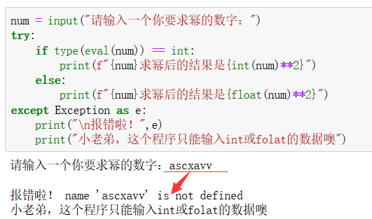

# *谁能九层台，不用累土起*

译：谁能建起九层的高台，不用筑起于每一堆泥土？

&nbsp;

Author：Masterpaopao

本博客Github地址：https://github.com/Masterpaopao/Relearn-Python

转载请注明原Github出处，谢谢。

# 教学目标

1）熟悉各种变量类型的运用

2）能够熟练地运用各种运算符

3）玩转各种Python内置的数据结构

4）接触到复杂的迭代器与集合方法

&nbsp;

## 一.语言基础

语言基础是个非常重要的部分，这将帮助你学习任何的编程语言。

&nbsp;

#### 1.只有变量

变量：将数据赋值一个名字成为一个变量，可以修改

常量：一旦被数据赋值，就不能被再改变，否则会报错

字面常量：一个单独声明的量，未被任何数据赋值

但是在Python的世界中，一切皆对象，赋值即定义。这是什么意思呢？

在Python中，不存在常量与字面常量，只有变量，这个特性不同于JAVA与C++。

来看看下面的四行代码，也许你可以明白一个量在Python中是能被反复赋值修改的：


这个图充分说明了Python是一门强类型的动态语言兼解释性语言，主要特性表现在动态性。

&nbsp;

#### 2.变量类型

在Python中一个变量的类型有许多种，在这儿可以划分为基本类型与内置数据结构

- 基本类型
  - int
  - float
  - bool
  - None
- 内置数据结构
  - str
  - list
  - tuple
  - set
  - dict

现在我们重点来讲一下这四个基本类型：

对于数字变量来说，在Python3中，分整型与浮点型，也就是int与float


你可以只通过有没有小数点来判断这是整型变量还是浮点型变量。

===================================================

再来说说这个bool变量类型，它的中文叫法是布尔

其实它只有两个值：True和False（对大小写敏感，其他写法都是错的）

这个类型用来判断条件的真假，帮助if语句进一步完善逻辑：


当然了，bool可以自成一个函数方法，用来判断语句是不是真的，但是不能判断等式：


在这儿留个题目，下面哪些变量是bool类型？

```python
a = 'True'
b = 1+2>2
c = 1!=4
d = False
```

===================================================

再来说说最后一种基本类型，None，你的第一印象就是空值的意思

在JavaScript中空值有undefined和null，但是Python的空值只有None

它既不是空字符串也不是未定义，它的作用是等同于你没有定义一个变量但是却使用，就会抛出个None

在布尔判断中，None等同于False的作用，但它不等于False，我想你应该明白这句是什么意思。


&nbsp;

#### 3.数据结构

在Python中有五大数据结构，我将在下面一一地列出来，帮助你们快速理解。

===================================================

- ##### 字符串str

```python
a = 'Masterpaopao is Handsome.'
b = "Masterpaopao is Handsome."
c = '''Masterpaopao is Handsome.'''
d = """Masterpaopao is Handsome"""
```

现在你应该明白字符串的符号一共有三种：单引号、双引号和三引号(可以分为两种)。

（说一下三引号吧，实际上c和d是没有区别的，侧重点在于三个引号，不重视是什么符号）

其中，单引号与双引号用于字符串变量的赋值，而三引号用于注释或支持换行的说明文字。

现在特意拿出三引号来说明下，支持换行是什么意思：


现在再来验证一下这些符号究竟相不相同：


所以，总结出一句话：

字符串的特性是变量是否相同对符号类型不敏感、只有三引号支持换行。

===================================================

- ##### 列表list

```python
a = [1, 2, 3]
b = [1, 1.1, '1.2']
c = ['1', '2', '2']
d = ['1,2', (1,2), [1,2]]
```

你应该明白，列表的标志性符号就是中括号，可以装进无数个对象。

根据这三句分析，Python的列表完全可以容纳下各种不同的数据变量类型对象，

这里面的东西都叫做列表的元素，这些元素可以容纳不同种类型，也可以重复。

我们来验证一下这两个列表是否相同：


所以，总结出一句话：

列表的特性是中括号、多样性，可重复，有序。

===================================================

- ##### 元组tuple

```python
a = (1, 2, 3, 4)
b = ('1', 2, 3)
c = (1, 2, 2)
d = ('1,2', (1,2), [1,2])
```

我们在学习了上面的列表之后，再来看看这儿的元组，就明白这些具有相似性。

元组与列表的区别是没有元素的说法，不能单独改变里面的一个值。

再来看看验证下是否为有序：


所以，总结出一句话：

元组的特性是小括号、多样性，可重复，有序，不可单独改变元素。

===================================================

- ##### 集合set

```python
a = {1, 3, 4, 7}
b = {'1', 2, 3.3, 4}
c = {(1,2,3), '1,2,3'}
```

集合的标志性符号是大括号，但是你可以发现我这次少了两个对比验证

一个是没有出现重复元素，一个不支持列表和集合的元素

所以我们进一步验证一下这个是否为有序：


出乎意料的是，这两个变量是相同的，这说明集合里面的元素是无序的。

所以，总结出一句话：

集合的特性是大括号、弱多样性(元素不支持列表与集合)，不可重复，无序。

===================================================

- ##### 字典dict

我敢说，字典才是所有数据结构中的灵魂所在，因为它是一种键值对的结构。

字典的键值对是啥意思？K=V结构，键是冒号前的变量，值是冒号后的值。

```python
a = a = {1:1, 2.0:'2', None:3}
b = {'a':'1,2','b':(1,2),'c':[1,2],'d':{1,2}}
c = {'e':{'f':'fff'}}
d = {True:1,False:2}
```

你一眼望去，是不是觉得字典的多样性非常强？它的值支持任意类型的数据。

先来识别下字典的键：


这说明字典的键支持Python的四种基本类型：int，float，bool和None。

最后再来验证一下字典是不是有序的：


通过这个我们得出一个最强的结论：

字典的特性是大括号、K=V存储结构、超强多样性，键不可重复，无序。

字典这部分肯定要重点掌握,它同样也是数据结构的灵魂，也是后面要学的json的载体。

&nbsp;

#### 4.类型转换

类型的转换毫无疑问是家常便饭，比如你拿到一个3的数据，但是你想转换成字符串形式

这些类型的转换在python中都有内置函数的支持

先来看看一个错误的例子：


这句话居然打印不出来，一看报错，两者类型不相同，不能直接相加打印。

好呗，那就只能用内置函数str()来转换为字符串类型再相加了：


那么，字符串转换为数字呢，也是可以的，有int()与float()两个函数

老规矩，来看看两个错误的例子:


这两个错误应该都看的明白吧？尤其是第二个错误，带小数点的就只能用float()

当然了，这个float要注意，这个可以对字符串的整数所使用：


这个完全是看需求来的，是选择int()还是float()。

&nbsp;

在这儿，我要说一句输出print的小技巧，在前面我们只能这样输出


难道每次使用我都要str转换一下吗？这也太麻烦了！

所以我们从现在就要养成一个习惯，学会使用f“{}"的形式来打印：


看到了吗，使用这个方法，完全不需要你愁类型的不同，直接f"{}"导入打印就可以。

&nbsp;

#### 5.本章小结

```
int：    整型
float：  浮点型
bool：   布尔型，只有True和False。
str：    字符串，有三种符号，其中三引号可以换行。
tuple：  元组，小括号、多样性，可重复，有序，不可单独改变元素。
list：   列表，中括号、多样性，可重复，有序。
set：    集合，大括号、弱多样性(元素不支持列表与集合)，不可重复，无序。
dict：   字典，括号、K=V存储结构、超强多样性，键不可重复，无序。
```

&nbsp;

## 二.运算程序

#### 1.运算符

假如我是面试官，我一上来就问你一个问题：

“Python一共有几种运算符啊？”

我敢说，大部分求职者肯定懵了，今天我就带你好好捋一捋。

===================================================

- ##### 算术运算符

算术运算符很好理解，无非就是那些加减乘除

```
+	相加
-	相减
*	相乘
/	相除
//	取整
**	求幂
%	取余
```

我这儿说一句废话，这些运算符只能对数字运算，也就是int和float。

你们可以自己下去一个个试，这些都是潜移默化的东西，肯定都会的。

===================================================

- ##### 比较运算符

```
>	大于
<	小于
==	相等
!=	不等
>=	大于等于
<=	小于等于
```

通过上面比较运算符得出的结果都是bool类型的结果，要么为True，要么为False。

===================================================

- ##### 逻辑运算符

```
and	与运算
or	或运算
not	否运算
```

不知道你们的数字逻辑基础好不好，这个应该是一个电路的原理，也就是与门，或门和非门。

这里面的运算是很奇妙的，一般只看第一个就能得出结果，这也是传说中的"短路"。

注意，在逻辑运算符中，被运算的必须是布尔型类型或支持转布尔类型的数据。

首先来看看与运算，两者都为真的时候才返回真，其他都是返回假：


再来看看或运算，两者都为假的时候才返回假，其他都是返回真：


最后的否运算，就很简单了，就是将布尔的值给反向输出


现在，我来说说”短路“的现象吧，这概念是跟数字逻辑的原理有关的

&nbsp;

先看看and的短路情况：


我将1和2交换顺序以后，输出的结果完全不相同，这是因为与运算中，你必须保证两个都为真，所以当电流通过第一个分支判定为真的时候，就会来到第二个分支继续判断，所以最终的结果都是最后面的数字。


这个图又说明了什么，当你遇到的第一个分支为假的时候，就直接返回最终的结果，这就是与运算的短路现象。

&nbsp;

再来看看or的短路情况：


这是或预算，当你遇到的第一个分支为真的时候，就立马返回结果，因为或运算只需要其中一个为真就能判断为真了。


当两个都为假的时候，返回的肯定都是第二分支的结果，与上面的and截然相反的，现在你应该明白我说的这些规律了，你可以把这些想象成一个电路。


&nbsp;

所以，我们来总结一下这个与运算和或运算中的短路现象吧！

```
and-与运算：
当两个为真的时候，返回第二个被判定的数据
当两个为假的时候，返回第一个被判定的数据

or-或运算：
当两个为真的时候，返回第一个被判定的数据
当两个为假的时候，返回第二个被判定的数据
```

一定要时刻注意这个现象，在使用的时候选择好顺序，返回你所期望的结果！

===================================================

- ##### 成员运算符

```
in	包含
not in	不包含
```

这个运算符的内容很简单，我们可以采用字符串，元组，列表，集合来讲一下：


发现了吗，成员运算符可以灵活运用于五大数据结构，不对，还差个字典！

那我们就来试一下字典的成员运算符吧！


咦？怎么报错了？是这样的，字典里面的成员运算符只针对键存不存在


===================================================

- ##### 身份运算符

```
is	同一身份
is not	非同一身份
```

这个与上面的成员运算符类似，又有它的独到之处，这个可以用来判断两个变量是否相等

注意，这儿的相等是指内存地址的相同。


当a='Master'开辟一个内存地址的时候，再创建一个相同的b变量，Python发现这个不是和a变量一样吗，所以就将b变量的内存地址也指向了a，所以两个变量内存地址相同。

至少，这个指向内存地址的原理对字符串有效，但是对其他数据结构就行不通了，具体的可以自己下去试试元组，列表，集合，字典等，开辟一个就是一个内存地址，并不会管你的元素内容相不相同。

实际上，这个应该也对数字有效的，但是却有一定范围的限制，来看看下面的代码：


这就要说一下这个底层cpython的解释器运行机制。它为了优化性能，给了一组数字范围，你用到了这里面的数字就直接给定你已经有的内存地址。当你脱离出这组范围使用数字的时候，就会给你开辟一个新的内存地址。

这组数字范围是-5~256。

&nbsp;

这个时候就要拿出可变对象和不可变对象的概念了！

分析一下上面的内容，我创造了两个一模一样的字符串，这两个变量都是指向于同一个内存地址；

还有int类型数据中的-5到256，这些数值的内存地址也是固定的；

还有bool中的True与False，这两个的内存地址也是固定的！

这三个东西的内存地址不允许被改变，属于不可变对象！

&nbsp;

然后再来看看list，dict，set吧，我直接上图


发现了吗，我每个代码块，都放两个相同值的变量，可它们的内存地址依旧不相等

这些玩意就叫做可变对象，内存地址一直在变化，并不会将指针的走向统一！

（注意，以上是我的粗暴理解版本，从指针的指向角度出发，与实际原理不符合，建议百度深入一下）

所以，我们通过身份运算符，就可以弄懂什么是可变对象与不可变对象

```
可变对象：list，dict，set
不可变对象：int，float，str，tuple，bool
```

===================================================

- ##### 位运算符

```
&	按位与
|	按位或
^	按位异或
~	按位取反
<<	按位左移
>>	按位右移
```

位运算符比一般的算术运算符速度要快，而且可以实现一些算术运算符不能实现的功能。

这意味着它的学习成本很高，需要你懂得二进制，原码补码反码的知识。

所以我在这儿只是给出一个概念，你知道有这个东西存在就行。

&nbsp;

我给出一个在Python中你会用到的两个位运算符的应用：


看到了吗，位运算符中的这个&能够判断一个数字还是奇数还是偶数。

原理很简单，一个数字的二进制中第一位(最右边)的数字是0还是1就能直接看出来是奇数还是偶数。


&nbsp;

再来说说最后一个位运算符的应用，这个就很好玩了，如何交换两个变量的值

这个在后端中的方法很常用，所以赶快学习下位运算符提升下性能吧！


看明白了吗，精华就在于这三句代码：

```
a ^= b
b ^= a
a ^= b
```

这三句代码就完成了两个变量值的交换的过程，至于原理我是真的说不清楚

建议各位亲亲记下笔记，以后直接套用这三句代码就可以了~

===================================================

- ##### 赋值运算符

赋值运算符绝对是使用频率最高的运算符之一，因为它常常配合条件与循环来完成一个程序的逻辑，所以这部分可以好好理解一下，只需要一分钟即可。

```
+=	自增运算
-=	自减运算
*=	自乘运算
/=	自除运算
……
```

事实上，所有的算术运算符都可以被用来赋值运算符，只要你知道怎么用。


如果你一时难以理解，你就记住一个公式“a += 1    -->   a = a + 1”

然后多用用你就记住了，这个赋值运算符主要在于熟能生巧。

===================================================

现在，你已经学会了Python中的七种运算符，还怕面试官问你吗？

来一张最后的总结图吧！


&nbsp;

#### 2.基本功

一个Python程序员的基本功到底是什么，不对，是所有编程语言的程序员的基本功是什么

这个基本功当之无愧的是条件与循环，它打造了程序逻辑的大半个江山。

在这个地方我会分为五个部分来讲解基本功

```
bool	学会判断条件的真假
if/elif/else	条件判断语句
for	循环语句
while	循环判断语句
continue/break	循环中的行为
```

===================================================

- ##### bool

为什么要在讲基本功之前，要再讲一遍bool呢？

因为在下面的条件与循环的学习中，我们常常要判断条件表达式的真假

先来看看下面的图，判断列表为真为假的情况：


在你开发的过程中，你常常会判断一个数据结构是否为空来进行是否下一步的操作

在上面的代码中，虽然这个元素是空的，但它毕竟算一个元素，自然是判定为真

再来看看字符串的判断：


千万不要被空格迷惑了，空格实际上等同于一个符号，算是有内容的东西哦！

&nbsp;

在这儿，我整理了一个表格，帮助你快速进行条件判断

| 数据类型            | 结果                                          |
| ------------------- | --------------------------------------------- |
| 字符串String        | 空字符串解析为False，有内容(包括空格)就为True |
| 数字Int与Float      | 只有0解析为False，其他都是True                |
| 布尔Bool            | 可以判断那些能被转换为bool结果的不等式，如1>2 |
| Tuple/List/Set/Dict | 没有元素就直接解析成False                     |
| 变量或对象Object    | 这个变量或对象只要存在就返回True              |

聪明的你应该看得懂这个表格，当你看懂了之后，你就可以玩转if判断了。

===================================================

- ##### if/elif/else

①当你只判断一个东西关注一个结果的时候，只用if语句

比如你想判断这个列表到底是不是空列表：

```python
list_one = ['one']

if list_one:
    print('这个list_one列表不是空的！')
```

使用if语句要注意，被判断的地方不需要加括号，然后就是使用英文冒号，再按回车的时候应该会自动产生一个缩进，这个缩进是四个空格，属于强制性的，所以要遵守代码规范。


如果这个条件是假的时候，会怎么样？当然是跳过这个print不执行啦！

```python
list_two = []

if list_two:
    print('我这句能被打印算我输')
```


现在你应该明白，if语句无非是判断真假来决定执不执行下面代码的行为。

&nbsp;

②当你判断一个东西关注两个结果的时候，用if/else语句

虽然我介绍了上面的if，但是事实上标准的用法应该是if/else，让你的代码更为严肃，但是一般不喜欢告诉你出错的人就会使用上面的单if语句，假装什么都没发生，不行就是不行。

这次我们使用分数来判断你是否能上清华大学：

```python
score = 630

if score > 650:
    print('恭喜你被清华录取了。')
else:
    print("对不起，你还不够格。")
```

注意，你的if与else必须处于同一个缩进，换句话说，这两个单词在一条竖直的线。

为什么这个else不需要写条件，不知道你懂不懂交集与并集的概念，你可以将整个条件作为整个集合，if条件占据了score>650的部分，那么else就是剩余的所有部分，为score<=650，所以不需要写条件的，直接冒号回车缩进写print就完事。

好了，来看看最终的结果吧，答案很明显，这哥们上不了清华：


说一下if与if/esle这两种到底有什么区别，前者只关注一种结果，有就给你反馈，没有就啥话也不说。后者则有两种结果，能够让看到的人知道自己被判断的结果是什么。

&nbsp;

③当你判断多种东西关注多种结果的时候，用if/elif/else语句

这个虽然是判断三种条件的语句，但是你如果想判断三个以上的条件呢？

公式就会变成if/elif/……/elif/else，用法都是一样的

这个elif其实是其他编程语言的else if，在Python被简化成一个单词了。

我们还是使用高考的例子来讲吧：

```python
score = 450


if score > 520:
    print("这位同学能上一本")
elif score > 450:
    print("这位同学能上二本")
elif score > 380:
    print("这位同学能上专科")
else:
    print("这位同学上不了大学")
```

这个就是多种条件的判断方式，最后你可以看出来这位同学只能上专科，因为刚好卡在450分


但是你写条件的时候，可千万不能写成这个样子：


这样写法虽然能行得通，但是完全没任何必要，因为Python是按顺序判断的，它在判断的过程中会自动排除掉一部分又一部分的条件，直到符合条件为止。

现在，你已经学会了if/elif/else，你可以进行大量的练习来巩固，也可以继续往下看，因为本章讲解的基本功都是互相联系分不开的，最后再进行混合练习也无妨。

===================================================

- ##### for

for，就是一个循环干活的语句，循环的本质就是遍历集合中的元素，先来看看下面的例子

```python
score_list = [630,591,555,700]

for score in score_list:
    print(score)
```

for……in……将会成为你最常用的遍历手段，这是从数据结构依次拿出单个元素，直到你拿出来全部的元素，这个for循环就结束的意思。

这句代码是什么意思呢，就是遍历这个score_list列表，然后依次拿出来打印，在这个过程中，你需要给每个拿出来的数据取个名字，这个名字就是score，每次循环，它的值都会指向新的元素。

输出的结果，很显然，print属于块级换行输出，所以输出是这样的：


当然了，有人觉得这样输出不好看，希望输出到一行，你其实可以改动print参数


这个就是最直观的for用法，无非是循环拿出来列表里的每一个元素。

当然了，你肯定对字典感兴趣，想知道for循环怎么结合字典来使用：

```python
score_dict = {"Master":555,"Paopao":666,"Npzoan":690}

for name,score in score_dict.items():
    print("这位"+name+"同学高考考了"+str(score)+"分")
```

说一下这个items()函数，属于python的内置函数，用来处理字典的键值对，将它们输出成一种特殊的dict_items的元组存储形式，用来方便被for进行遍历


你只需要知道items的作用就可以了，理解成一种能被for循环的数据结构也没问题


如果你看不懂，没关系，只要你明白这段程序是什么意思就可以了，for循环同样能够取出字典的键值对进行操作就可以了。

&nbsp;

当然了，我们绝对不能忘记range()函数，可以说是专门为for循环而生的一个内置函数。

这个函数你可以理解为自动创建一个列表的函数，不妨看我这个图了解：


所以你可以提炼出一个重要的信息，这是一个前闭后开的函数，比如range(0,2)就等同于[0,1]

再来看看下面这一段粗暴的例子:


range(1,5)就等同于[1,2,3,4]，现在你应该明白range()怎么用了吧，是不是非常简单。

现在我们的range()还有个快速的应用，就是求某段数字范围内的奇数或偶数：


在上面第一张图中你也看到了，第三个参数就叫做步长step，range(0,5)就等同于range(0,5,1)，只有1个步长，代表一个数据走到下一个数据需要走1步，步长就是这么理解的。

所以我求1到20内的奇数，步长设置2就行了，这意味着一个奇数走两步就到下一个奇数。

但是！！我们要抱着科学态度，range(0,2)究竟等不等同于列表[0,1]呢？

我们来看看实验的结果：


很显然不是！但是range()创造出来的却能被for循环当作列表去用，这一点要记住。

那么我们的range(0,1)需要怎么直接转换为列表[0,1]呢？直接加个list()转换即可：


===================================================

- ##### while

while同样也是循环，可是它与for的区别到底是哪？

while是带着条件判断去循环的，在这其中会遇到赋值运算符，还是上一段代码吧！

```python
count = 5

while count > 0 :
    print("现在的数字是"+str(count))
    count -=  1
```

这段程序是什么意思，就是首先对循环的条件进行判断，发现count满足，就进入while下面的代码开始执行，在执行完代码的时候，必须完成自减运算，让count减一回到开头，否则这个循环永不刹车的，凭电脑的计算速度，小心让你的电脑崩溃！


事实上，while还能与if相结合使用，也就是在循环的途中进行条件判断

```python
day = 1
print("上头命令在5天之内抓到犯罪嫌疑人")

name_list = ["whaha","miao","wheehei","Master","Hahaa"]
print("这是犯罪嫌疑人名单，每天审讯一个吧！")

    
while name_list:
    if day == 5:
        print("\n混账，现在是最后一天了！")
    print(f"现在是第{day}天")
    name = name_list.pop()
    print(f"正在审问{name}中……")
    if name == "whaha":
        print("终于抓到你了，犯罪嫌疑人就是你！")
    day += 1
```

你可以仔细看这段代码，这段代码是怎么发挥作用的，怎么将if与while结合的

这个是在五天之内必须找到犯罪嫌疑人的故事，在最后一天截至的时候，终于找到了。


当然了，代码里面的pop()函数我们会在后面讲到，你可能不明白这个while是怎么终止的，这个pop()函数会将列表里面的元素弹出去，当全部弹出去之后就成了空列表，自然就停止循环。

你可以仔细品味一下这段程序，确保你弄懂了while怎么用，还知道怎么与if结合。

现在我们来看看循环中的continue和break两个重要的参数。

===================================================

- ##### continue/break

如果一个循环，只能让它完整地循环，而你不能做什么，那该多么无趣

所以我们对for与while这两种循环都设有了continue与break，注意，这两个只能在循环使用。

①continue

终止本次循环的执行,接着进行下一次循环条件的判断。

也就是说，一旦碰到continue，就无视循环体内剩下的代码，回到循环体的开头。

来一段代码，帮助你理解一下continue的作用：

```python
num_list = [1,2,3,4,5,6]

for num in num_list:
    if num == 4:
        print("我觉得这个数字不吉利，不想求幂")
        continue
        
    print(num,num**2)
```

这是什么意思呢？从一个数字列表拿出来每个元素，进行求幂并打印，但是这位写程序的人嫌弃4数字不吉利，甚至都不想打印出这个4，所以直接跳过了打印，来到了下一个数字。


这个例子应该通俗易懂，你可以拿掉这个continue来对比一下，一下子秒懂


&nbsp;

②break

一旦触碰到break，停止循环，直接跳过循环的全部代码，进入循环下面的代码执行。

我们可以直接拿上面的抓捕犯罪嫌疑人的 例子，假如我们第二天就抓到了犯罪嫌疑人，那么下面五个还需要审问吗？所以这个时候需要上个break终止一下循环：


这个例子够直接粗暴吗？如果你还是看不懂，我还是写个简单例子说明一下吧：

```python
count = 1

while count > 0:
    
    if count > 10:
        break
        
    print(count)
    count+=1
```

这个程序还看不懂我就没办法了！


总之，灵活运用continue和break能够更好地约束循环中的行为，接下来我们会接触input函数与异常处理来写更加完善的循环程序，练习多的是！

&nbsp;

#### 3.来输入

在上面，我们给定的变量都是固定的，这会不会让编程变得生动无趣。

所以我们需要input()函数，通过键盘来与程序进行交互。

首先先来了解一下我们输入的东西到底是什么：

```python
result = input("请输入你喜欢的一个数字：")
print(result)
print(type(result))
```

当这个程序运行的时候，它会弹出个输入栏让你输入数字，输完按回车即可。


发现了吗？最终的结果居然是字符串形式的！

请记住：input()函数的结果其实是你键盘输入的数据以字符串的形式赋值给你设置的变量。

这下就得出一个重要的结论，你input输入的任何东西都是字符串形式的，如果你需要处理这个数据的话，需要先转换一下类型！

现在，我们就写一个简单的求幂程序，主要是向你们展示类型转换的关键之处：


&nbsp;

你可以用input()去做很有意思的事情，可以完成一些有意思的交互，正好我也想借助input()函数再跟你们复习一下上面所学到的基本功内容。

写个input()+while+if相结合的程序吧，融会贯通才是最好的学习方式：

```python
while True:
    text = input("有什么想对倒叙复读机说的吗？")
    
    if text.lower() == "quit":
        print("对话结束")
        break
        
    print(f"你说-->{text}")
    print(f"我说-->{text[::-1]}\n")
```

这段程序干货非常多，有三个重要的知识点：

一个是while True，代表循环永动机，不出意外的话它会一直循环下去。

另一个是lower()函数，它负责将一个字符串的所有字母内容变成小写。

最后一个就是[::-1]，这个操作叫做倒序切片，负责将字符串的内容进行反转，我们会在后面的内容中讲解切片。其余的部分你们应该看得懂了：

这就是一个循环聊天器，机器人会将你说的话进行倒序复读，当你不想聊天的时候，你可以输入quit来结束对话，完美融合了while+if+input()+break等多方面知识。


但是你心里会明白，你必须考虑到异常输入的情况，不可能所有的输入都是符合规范的，总有输入会引起程序异常，这就是下一个小节要讲的内容。

&nbsp;

#### 4.刚异常

再来回顾一下上面写的输入程序：

```python
num = input("请输入一个你要求幂的数字：")
print(f"{num}求幂后的结果是{int(num)**2}")
```

就这段程序，没有任何异常处理，我有两种方式让这个程序崩溃，你信吗？


看到了吗，一切的源泉都是因为那个int(num)，这个地方你只能输入int类型的数据，不然就会导致程序异常中止，所以我们应该怎么解决这两个BUG呢？

首先，先解决输入float的问题，这个并不算异常，因为float数字也能求幂，所以直接上if/else设置两个分支就可以了。

但是，写程序之前，我们遇到了一个难题：


现在，你已经知道了强大的eval()函数。它的功能类似于脱掉字符串的外衣，OK，写代码！

```python
num = input("请输入一个你要求幂的数字：")
if type(eval(num)) == int:
    print(f"{num}求幂后的结果是{int(num)**2}")
else:
    print(f"{num}求幂后的结果是{float(num)**2}")
```

这样是不是就很简单了~~，随便输入点小数点，结果是没任何问题的：


现在，我们来解决最有一个问题，输入字符的问题，这个是没办法解决的，你一个字符怎么求幂？所以，这个时候，我们的异常处理模块就登场了。


其实异常处理模块有很多种写法，但是我只采用着这种最终标准的写法，属于万金油。

我会来一段经典地异常处理模块代码，让你快速上手：

```python
name_list = ["Master","Npzoan","Paopao"]
try:
    print(name_list[3])
except Exception as e:
    print("报错的内容如下：",e)
    print("你查询的似乎超出了列表的索引")
```

你可以很明显地看出来，try里面的代码是错误的，因为我这个name_list列表的索引分别是0,1,2，最大的索引值是2，而这个3是不存在的，必然报错。所以except里面的第一句print，变量e（Exception as e的意思就是给报错的变量起个别名为e）打印出Python的报错，第二句print是自己自定义的报错语句，所以最终的结果是这样的：


如果你还是看不懂异常处理模块怎么用，虽然我的教程面向于已经学过Python的人，但是不乏有些初学者会浏览我这个博客，我的建议是你可以上菜鸟教程学习一下，熟悉一下这个原理就行。

现在，让我们最开始的代码，使用异常处理进行改正吧！

```python
num = input("请输入一个你要求幂的数字：")
try:
    if type(eval(num)) == int:
        print(f"{num}求幂后的结果是{int(num)**2}")
    else:
        print(f"{num}求幂后的结果是{float(num)**2}")
except Exception as e:
    print("\n看看报错的内容是什么：",e)
    print("小老弟，这个程序只能输入int或folat的数据噢")
```

现在，你应该看得懂了吧？现在这个程序已经变成了成熟的程序，不管你输入什么都不会再引起程序异常终止，这便是异常处理的魅力。



&nbsp;

#### 5.看输出

现在，我们已经讲完了python基础的一半，当我写到这儿的时候，我意识到我没有好好地讲一下print()的内容，实际上，对于字符串与变量的混合输出方式，一共有五种，我逐一介绍一下：

1）使用逗号输出

print("第一种输出",e,"的方式")


可以知道这种方式，逗号会带来一个空格的分隔。

===================================================

2）使用加号输出

print("第二种输出"+e+"的方式")


加号输出的方式不会带来空格的问题，但是缺点：如果是数字，需要改变类型。

===================================================

3）使用f"{}"输出


这种方式我推荐大家重点使用，因为不需要考虑数据类型。

===================================================

4）使用{}.format()输出


这样也可以，相比较第三种方法是繁琐了点，如果你要用多个变量，就这样写：


空大括号的顺序是有讲究的，是根据format里的参数来。

===================================================

5）使用%格式化输出

如果你对变量的类型的区分有要求，可以使用%s与%d，分别是字符串与数字


与format的用法是类似的，这个格式化输出的方式严格控制变量类型，也是可以使用的。

&nbsp;

#### 6.写作业

好了，你已经看到了这儿，这意味着你学完了程序的基本功，知道怎么编写条件与循环，知道怎么用input()函数与程序交互，还知道怎么用异常处理模块完善程序，现在的你，已经有能力编写一个成熟的程序了。

这儿给你奉上的是两张总结图：

①复习下运算符


②Python的基本功


现在即将出场的是 ，两份热乎乎的作业，我希望大家都能自觉完成。

第一份作业：打印出9x9乘法表口诀，作业效果如下：


第二份作业，就很难了，这也是培养你百度的能力，打印出斐波那契数列。

&nbsp;

## 三.数据结构

#### 1.开场白

不知道有一个年度最佳微小说你们有没有看过：


其实我也是这样的，我写着写着，就失去了初心，因为本来我这篇博客就是面向已经学过python的人，但是我写着写着，又不小心写的很详细，又成了个小白入门教程。

矛盾在于我也有我自己的时间，我需要加快我复习的步伐，因为前方等着我的是Django的学习，SQL的强化和数据结构与算法的学习，我的时间很紧，我也要备战秋招。

所以我的教程即将更换风格，全心全意地写总结式教学了，在后面你将看不到详细的解释，取而代之的是各种函数方法的用法总结。

如果你是小白，你学到了这儿，我只能提醒你，你还需要去了解变量的命名规则，缩进是什么，代码的风格是怎么样的，这些都能帮助你编写更加规范的Python程序。

现在，往下的内容你将看到五大数据结构的函数用法汇总，请敬请阅读！

&nbsp;

#### 2.字符串

怎么操作字符串，在学习之前必须要有个清晰的思维，就是从增删改查四个角度去学习。

但是我们是有基础的人，所以要往深度拓展，所以我接下来的教学将会分下面八个部分：

- 增·
- 删
- 改
- 查
- join
- split
- 转义
- 判断

接下来就看好了，我的表演时间到了。

===================================================

- ##### 增

```
# 1 - 直接相加
"Welcome" + "you" + "!"

# 2 - 格式化
"I'm %d years old."%20

# 3 - 使用format
"{} loves {}.".format("Master","Paopao")

# 4 - f"{}",重点使用
age = 20
f"The beautiful girl is {age} years old,too."
```

这些知识，在上面的print()输出我们就已经接触过了，再复习下也好


===================================================

- ##### 删

字符串的删，实际上是删不掉的，因为你已经创造出来这个变量了

所以这儿的删，是直接赋值空字符串，清空内容


===================================================

- ##### 改

```
replace()	替换内容
upper(),lower(),title(),swapcase()	改变大小写
lstrip(),rstrip(),strip()	删除空白
zfill(),ljust(),rjust(),center()	填充长度
```

现在，我会将代码和结果全部放在一个文本框，以----为分割线。

&nbsp;

使用replace()替换掉所有的@成空字符串，达到删除的目的

```python
str = "Ma@ster@Pao@pa@o"
new_str = str.replace("@","")
print(new_str)
----
Masterpaopao
```

使用upper()让所有字母变成大写

```python
str = "Masterpaopao666"
new_str = str.upper()
print(new_str)
----
MASTERPAOPAO666
```

使用lower()让所有字母变成小写

```python
str = "MasterPAOPAO"
new_str = str.lower()
print(new_str)
----
masterpaopao
```

使用title()让所有的单词首字母变成大写，其他均小写

```python
str = "Master LOVE paoPAO"
new_str = str.title()
print(new_str)
----
Master Love Paopao
```

使用swapcase()可以让所有的大小写反转

```python
str = "MaSTer"
new_str = str.swapcase()
print(new_str)
----
mAstER
```

使用lstrip()删除字符串左侧的空白

```python
str = "  Master  "
new_str = str.lstrip()
print("|"+new_str+"|")
----
|Master  |
```

使用rstrip()删除字符串右侧的空白

```python
str = "  Master  "
new_str = str.rstrip()
print("|"+new_str+"|")
----
|  Master|
```

使用strip()删除字符串左右侧的所有空白

```python
str = "  Master  "
new_str = str.strip()
print("|"+new_str+"|")
----
|Master|
```

当然了，strip()还能删除你不喜欢的内容，但是只能删除处于首和尾的内容

```python
str = "Master666"
new_str = str.strip("666")
print(new_str)
----
Master
```

zfill()是个特殊的填充方法，参数指定长度，不够的就在左边填充0，专门用于二进制

```python
num = "110110"
new_num = num.zfill(16)
print(new_num)
----
0000000000110110
```

使用ljust()填充内容，可以自己选择填充符号，虽然是l，但向右填充

```python
str = "救救我"
new_str = str.ljust(10,'!')
print(new_str)
----
救救我!!!!!!!
```

使用rjust()填充内容，可以自己选择填充符号，虽然是r，但向左填充

```python
str = "注释大军"
new_str = str.rjust(10,'#')
print(new_str)
----
######注释大军
```

使用center()能够将字符串内容置中，指定填充符号与长度

```python
str = "分割线"
new_str = str.center(30,'·')
print(new_str)
----
········分割线·········
```

目前大概总结一下，就是这么多：


===================================================

- ##### 查

```
find()	正序查找字符就返回正序索引值，找不到就返回-1
rfind()	倒序查找字符就返回正序索引值，找不到就返回-1
index()	正序查找，功能类似find()，找不到就抛出异常
rindex()	倒序查找，功能类似rfind()，找不到就抛出异常
count()	计算指定字符的个数，如果没有就返回0
```

特地说明一下，index()的功能与find()没区别，区别在于index会抛出异常终止程序

至于这个rfind()，虽然是从右往左查找，但是如果找到了，返回的结果依然是正序的索引位置。

再说明一遍，只以找到的第一个符合条件的位置为返回结果。

&nbsp;

我们可以使用find()在字符串中寻找指定的字符

```python
str = "just the way you are"
print(str.find("h"))
----
6
```

我就啰嗦一下，find的寻找机制吧：


当然，也可以使用rfind()从右往左查找，但是返回的结果依然是正序索引值

```python
str = "just the way you are"
print(str.rfind("a"))
----
17
```

find()和rfind()还有更为复杂的范围查找应用，下面的index()也可以用，这个可以自行了解

```python
str = "just the way you are"
print(str.find("a",5,15))
----
10
```

我在弄个图帮助你们理解下，弄不懂的自行百度：


当然了，我们必须考虑到查找不到字符的情况，自然是返回-1了

```python
str = "just the way you are"
print(str.find("z"))
----
-1
```

至于这个index()和rindex()的功能是与find()与rfind()一样的，不同之处在于能抛出异常


最后再来说一下这个count()，实际上这个函数非常常用，用来统计是再好不过的选择

```python
str = "just the way you are"
print(str.count("a"))
----
2
```

啰嗦一下，这个count()找不到就返回0，然后也支持范围查找：

```python
str = "just the way you are"
print(str.count("a",5,15))
----
1
```

===================================================

- ##### join

join是生成字符串的一个必不可少的手段

比如你拿到了一个列表，你想要把它们以指定的连接符号给连在一起

```python
url = ['www','baidu','com']
new_url = '.'.join(url)
print(new_url)
----
www.baidu.com
```

其实元组也可以，组成一个电话号码

```python
tel = ('133','6789','4567')
new_tel = '-'.join(tel)
print(new_tel)
----
133-6789-4567
```

===================================================

- ##### split

split()你可以理解成join的反向过程，用于将字符串以指定的分隔符来生成列表

```python
str = "百度/阿里/腾讯/京东/拼多多"
str_list = str.split('/')
print(str_list)
----
['百度', '阿里', '腾讯', '京东', '拼多多']
```

其实还有rsplit()，这是反向分割的函数，你了解有这个存在就好。

===================================================

- ##### 转义

转义，在你写字符串说明文本的时候，是非常重要的，最重要的肯定是那个换行符\n

```
\a	响铃
\b	退格
\f	换页
\n	换行
\t	跳到下一个tab
\r	回车
\\	转义'\'
\'	转义单引号
```

建议上菜鸟教程把这些转义字符都学一遍，我在这只讲\n,\t和\\\三个转义符号的使用。

\n不用说，在字符串里起到换行的作用，\t则就是隔一个tab的空格距离，也就是一个缩进

```python
print("打开这深夜\n抚摸寒星光")
print("依旧太寂寞\t依旧太凄凉")
----
打开这深夜
抚摸寒星光
依旧太寂寞	依旧太凄凉
```

重点说一下，\\\这个的使用吧，实际上就是一个\在转义，让能发挥作用的字符失效

比如我这个错误使用方法，肯定是不行的：

```python
print("换行的符号是\n")
----
换行的符号是


```

这个时候肯定要再加一个\去进行转义，让功能符号失效

```python
print("换行的符号是\\n")
----
换行的符号是\n
```

===================================================

- ##### 判断

字符串肯定要支持判断的，不然就无法和条件与循环相结合应用呢~

以下有5个函数供使用，都是返回bool结果：

```
startswith()	判断字符串是否以某个前缀开始
endswith()	判断字符串是否以某个后缀开始
isalnum()	判断是否为只含有字母与数字的字符串
isdecimal()	判断脱去字符串外衣的时候是否为纯数字
isidentifier()	只判断是否以字母或者下划线为开头
```

首先startswith()与endswith()肯定是最常用的；这个isalnum()在后端中可以用于规范用户名注册，不允许含有非字母与非数字的存在；这个isdecimal()更不用说了，与用户交互的时候，用户发送的数据全是字符串，你就用这个来脱去字符串外衣来筛选即可；最后的isidentifier()比较少见。

&nbsp;

对于startswith()与endswith()的使用，我想写个综合性程序，会用上input()+if+endswith()，去实现摄氏温度与华氏温度之间的转换，话不多说，我直接上代码吧!

```python
temp=input("请输入摄氏温度或华氏温度（示例：1C或1F）:")
if temp.endswith("C"):
    temp=float(temp.strip("C"))
    print("摄氏温度转换为华氏温度的公式为：Tf=(9/5)*temp+32")
    Tf=(9/5)*temp+32
    print("转换后的华氏温度为："+str(Tf)+"°F")
elif temp.endswith("F"):
    temp=float(temp.strip("F"))
    print("华氏温度转换为摄氏温度的公式为：Tc=(5/9)(Tf-32)")
    Tc=(5/9)*(temp-32)
    print("转换后的摄氏温度为："+str(Tc)+"°C")
else:
    print("你输入的数据有误，系统退出。")
```

在将这段代码之前，先来讲一讲这段代码遇到的匪夷所思的报错：


我确定我的程序没有任何问题的，可这儿就是报错，于是我百度了一下，我扇了自己一巴掌

我完全忘记了关键词使用规范：不能将关键字直接命名为变量。

我这个报错的原因是我在前面直接使用str命名为变量，刚好与str()内置函数引起冲突。

所以大家今后要养成良好的习惯，不要将关键字直接命名成变量，比如str，list，try，if等等。

好了，再来看看这段程序，毫无疑问这个完美结合了endswith()去判断单位：


如果你已经看懂了，那么就主动写一个长度单位转换器吧，你写出来的程序才是你自己的。

&nbsp;

可以使用isalnum()判断这个字符串是不是只含有数字与字母：


isdecimal()在后端中非常重要，判断是否只含有数字：


isidentifier()虽然很少用，但是用来判断首字母是不是非数字，这个还是可以的：


===================================================

- ##### 最终总结

现在，你一路看下来应该很辛苦吧，因为字符串确实是核心，它所需要学的内容确实多

你已经掌握了字符串的八大部分：增、删、改、查、join、split、转义和判断。


&nbsp;

#### 3.列表

如果你是纯小白，我建议你可以看看我之前写的两篇关于列表基础的博客，自认为写的还是不错的。

https://www.cnblogs.com/Masterpaopao/p/10003671.html

https://www.cnblogs.com/Masterpaopao/p/10022739.html

事实上，列表的学习也可以通过增删改查这四个角度去学习，同样的是，我们的学习应该富有深度，所以不出意外，又是分8个部分去讲解列表。

- 索引
- 统计
- 增
- 删
- 改
- 查
- 排序
- 拷贝

OK，开始我们今天的列表教学~

===================================================

- 索引

索引对于列表是个很重要的基础（其实字符串也有索引，感兴趣的可以试试）

我们在上面的异常中就已经接触了什么是索引，虽然大家都有基础，我就再啰嗦一遍：

索引是从0开始的，如果一个列表有5个元素，那么第5个元素的索引就是4，超出则报错。

当然，索引是支持负数的，比如倒数第一个元素就是-1，倒数第二个就是-2，过头了也报错。

```python
list_one = ['a','b','c','d']
print(list_one[3])
print(list_one[-2])
----
d
c
```

===================================================

- 统计

还记得字符串的那个count()统计吗，对于列表也是一模一样的原理，找不到就返回0

```python
l = ['a','a','c','a','b']
l.count('a')
----
3
```

===================================================

- 增

列表的增分很多种，主要分两个方向：创造列表和列表元素的增加

```
range()	将range()的数组转换为列表
split()	分割字符串成一个列表
+	两个列表相加合并，需要赋值新列表
extend()	两个列表相加合并，直接影响被操作的列表

append()	在列表末尾追加进去元素
insert()	在指定索引位置插入元素
```

要注意这两组方法的区别，前面一组是针对于列表本身的操作，后面一组是针对于列表的元素操作。

&nbsp;

range()已经是我们的老熟人了，一种快速创造数字列表的方法，需要list()转化

```python
list_1 = list(range(1,5))
print(list_1)
----
[1, 2, 3, 4]
```

split()同样也是我们的老熟人，如果有字符串你想弄到列表里，那这个方法当仁不让

```python
list_2 = "淘宝-天猫-京东-苏宁".split("-")
print(list_2)
----
['淘宝', '天猫', '京东', '苏宁']
```

+，两个列表直接相加的方法也是可以的，就如同字符串一样，但是这个过程需要赋值到新的变量

```python
new_list = list_1 + list_2
print(new_list)
----
[1, 2, 3, 4, '淘宝', '天猫', '京东', '苏宁']
```

extend()这个方法毫无疑问比上面的直接相加要好得多，因为不需要创建新的变量

```python
print(list_2)
list_2.extend(list_1)
print(list_2)
----
['淘宝', '天猫', '京东', '苏宁']
['淘宝', '天猫', '京东', '苏宁', 1, 2, 3, 4]
```

（extend()函数能操作的不只是列表，它能操作的是一切可迭代的对象，包括字符串，元组等）

append()这个方法是列表中最常用的方法了，将元素追加到列表的最后面中

```python
list_3 = ["腾讯","阿里"]
list_3.append("百度")
print(list_3)
----
['腾讯', '阿里', '百度']
```

&nbsp;

至于append()方法常常用与for循环相结合使用，分析出一个结果后立马append，在这样来循环。

但是有些新手程序员，将一个列表的所有元素用append()方法追加到另外一个列表，这个毫无疑问不利于代码的时间复杂度，应当直接使用extend()才对。


如果你能明白我这两段程序对比的意思，还知道时间复杂度是什么意思，那再最好不过了。

我这么做，只是想强调，当你真正编程的时候，必须考虑到你代码编写的运行时间与维护成本。

&nbsp;

insert()方法同样也是插入元素的方法，但它可以在指定的位置插入元素

参数的顺序是这样的，先填索引的位置，后填你要在这个位置插入的元素值

```python
list_6 = [1,2,3,4,5,7]
list_6.insert(5,6)
print(list_6)
----
[1, 2, 3, 4, 5, 6, 7]
```

插到倒数第二个位置直接填-2，插到最后一个位置还不如用append，想知道为什么吗？

同样是时间复杂度的问题，insert()的源码有for循环，所以能实现任意位置插入，时间复杂度为O(n)；而append只是插到最后一个位置，不需要for循环，时间复杂度为O(1)。

所以这个对比告诉我们，能用append()就用append()，都是为了代码的性能考虑。

===================================================

- 删

注意，我在下面介绍额三个方法，都是能直接影响被操作的列表的。

```
pop()	没有索引参数直接弹出最后一个元素，返回值就是此元素
del	输入具体索引值，直接删除这个位置的元素，删除的值无法访问
remove()	不知道元素位置，输入元素的值作为参数，删除的值无法访问
clear()	直接清空列表里的所有元素
```

&nbsp;

pop()，当之无愧地成为我们学习的重点，因为不光可以弹出元素影响原列表，并将弹出去的元素成为返回值，与此同时，你还能填进去索引的参数，弹出指定位置的元素。

```python
list_7 = ["唐三","小舞","戴沐白","朱竹清","奥斯卡"]
l_7 = list_7.pop()
print(l_7)
print(list_7)
----
奥斯卡
['唐三', '小舞', '戴沐白', '朱竹清']
```

这段代码不难理解吧，pop()的返回值就是弹出去的元素，同时打印列表，值确实被影响了。

再来看看有参数的pop()，比如pop(0)就是弹出第一个元素：

```python
l_0 = list_7.pop(0)
print(l_0)
print(list_7)
----
唐三
['小舞', '戴沐白', '朱竹清']
```

del的使用，通过索引值参数的手段来删掉元素，这个被删掉的元素无法被访问，没了就是没了

但是这个方法并不推荐使用，因为它是逐一查找，时间复杂度的性能并不占优势，所以列表删除就用pop

```python
list_8 = ["萧炎","药老","唐三","云韵","美杜莎"]
del list_8[2]
print(list_8)
----
'萧炎', '药老', '云韵', '美杜莎']
```

（注意，del是一个关键词，所以你看上去会觉得这个很特殊，加个空格就可以删除列表元素了）

remove()的用法就很好解释了，就是你有一个很长的列表，你不知道你想删除的元素索引值在哪儿，或者说你根本不关心索引在哪儿，你就想要删掉这个元素，直接输入元素值参数即可~

但是你如果有多个相同的元素要删除，这个方法，是删除第一个找到的元素。

```python
list_9 = ["a","a","a","a","b","a","a","a","a","a"]
list_9.remove("b")
print(list_9)
----
['a', 'a', 'a', 'a', 'a', 'a', 'a', 'a', 'a']
```

clear()这个方法没话说，暴力清除元素就完事

```python
list_10 = [1,2,3,4,5,6,7]
list_10.clear()
print(list_10)
----
[]
```

===================================================

- 改

```
[ ]	通过索引的方式直接修改值
```

这部分的内容就很简单了，你想改元素就通过索引改就行

```python
list_11 = ["a","d","c"]
list_11[1] = "b"
print(list_11)
----
['a', 'b', 'c']
```

当然了，你如果不知道你要修改的元素索引值是多少，可以结合下面要讲到的index()方法。

===================================================

- 查

要注意的是在列表中，没有像字符串那样的find()方法，只有会抛出异常的index()方法

```
[ ]	通过索引的方式打印出来
index()	找到就返回索引值，找不到就抛出异常
len()	求列表的长度，也就是列表有多少个元素
```

&nbsp;

[ ]方法我就不说了，大家都会，我来讲讲上面删除元素的问题，可以先index()找到再del删掉


len()方法也是必用的，就是查询列表的长度，得到的值是int类型


===================================================

- 排序

```
reverse()	把列表的元素倒序排列，影响原列表
sort()	按照一定的规则进行排序，比如数字大小、26字母排序
sort(reverse=True)	按照与规则相反的方法进行排序
[::-1]	切片操作，另一种倒序排列的方法,但是不影响原列表
```

&nbsp;

reverse()就是单纯地将列表里的元素顺序全部倒过来

```python
list_one = ["b","f","r","e","p","t"]
list_one.reverse()
print(list_one)
----
['t', 'p', 'e', 'r', 'f', 'b']
```

sort()就不是单纯的排序，它会自动根据一定的规律而升序排列，比如数字大小与首字母

```python
list_two = ["sda","auz","psd","qrt","mui"]
list_two.sort()
print(list_two)
----
['auz', 'mui', 'psd', 'qrt', 'sda']
```

sort(reverse=True)就很好理解，与规则相反的排序方式

```python
list_three = [1521,573,213,2157,6,34]
list_three.sort(reverse=True)
print(list_three)
----
[2157, 1521, 573, 213, 34, 6]
```

[::-1]这个属于下面要讲到的切片操作，直接倒序排列，但是这个方法不影响原列表，适合打印看看

```python
list_one = ["b","f","r","e","p","t"]
print(list_one[::-1])
print(list_one)
----
['t', 'p', 'e', 'r', 'f', 'b']
['b', 'f', 'r', 'e', 'p', 't']
```

===================================================

- 拷贝

列表的拷贝自然是面试中常常要问到的问题，我来给你们好好捋一捋

```
列表拷贝	直接赋值，致两个变量都指向于同一个列表
浅拷贝	使用copy()方法，但是如果元素存在列表，这个列表依旧被关联
深拷贝	使用deeocopy模块深拷贝，两个列表互不影响
```

&nbsp;

列表拷贝，就非常好说，两个变量指向同一个列表，当你改变其中一个变量，另外一个就改变

```python
la = ["1","a","%"]
lb = la
lb[1] = "b"
print(la)
print(lb)
----
['1', 'b', '%']
['1', 'b', '%']
```

&nbsp;

浅拷贝，就是直接用内置的copy()方法，如果列表里没有列表元素，两个互不影响

```python
lc = ["1","a","%"]
ld = lc.copy()
ld[1] = "b"
print(lc)
print(ld)
----
['1', 'a', '%']
['1', 'b', '%']
```

这么一看，结果是不是很正常，但是这只是针对于只含有内存地址不可变对象的情况。什么？你看不懂我这一句？什么是可变对象，什么是不可变对象呢？你怕不是没好好读上面的身份运算符的内容。

所以我如果用一个含有可变对象元素的列表，浅拷贝毫无疑问还是会引用这个可变对象元素进行改变，比如说["a","b",[1,2]]，你进行浅拷贝，前两个元素的改动，不影响你浅拷贝出来的新列表，但是最后一个元素却能影响，因为浅拷贝能对可变对象元素产生引用关联。

总结一下：浅拷贝依旧对可变对象元素能产生引用关联。

看一波代码：

```python
le = ["a","b",[1,1]]
lf = le.copy()
lf[2][0] = 0
print(le)
print(lf)
----
['a', 'b', [0, 1]]
['a', 'b', [0, 1]]
```

看到了吗，对于可变对象的元素，浅拷贝还是产生了引用关联，两个列表都改变了。

&nbsp;

这个时候，还是要大哥登场，也就是最后的深拷贝，完完全全地两个互不干扰的列表。

```python
from copy import deepcopy
le = ["a","b",[1,1]]
lf = deepcopy(le)
lf[2][0] = 0
print(le)
print(lf)
----
['a', 'b', [1, 1]]
['a', 'b', [0, 1]]
```

===================================================

- 最终总结

同样是给出一份总结大图，自己也要下去亲自敲代码多练练！


&nbsp;

#### 4.元组

在学过前面的列表之后，元组就非常好学了，它所使用的符号是小括号

它并没有所谓的增删改查的方法，所以我分下面的四个角度去讲解元组tuple！

- 索引
- 不能修改元素
- 可以修改可变对象元素里面的元素
- 陷阱
- 工厂函数

&nbsp;

===================================================

- 索引

元组毕竟与字符串，列表一样，属于可迭代的数据结构，所以它也支持索引

```python
tu = (1,2,3,4,5)
print(tu[2])
print(tu[-2])
----
3
4
```

===================================================

- 不能修改元素

但是！虽然元组支持索引，但是它只允许打印访问，不允许修改！


看到了吗，元组不支持修改元素的操作，这印证了我们在上面学到的元组属于不可变对象的知识！

对于相同的元素，如果你希望固定下来，使用元组存储毫无疑问比列表来得更为安全。

===================================================

- 可以修改可变对象元素里面的元素

当你第一眼看到这个标题的时候，你也许会说，什么鬼！不是说不能修改元素吗？

注意看好了，我这个标题的意思是可以修改元素里面的元素！你是不是想起了浅拷贝？

虽然元组本身是不可变对象，你也不能直接修改元组里面的列表元素，但是列表元素的元素就不能动了吗？

首先来看看尝试修改列表元素的操作，肯定是报错的：


但是我如果要修改列表元素的元素呢？这个就可以了~

```python
tr = (1,2,3,[5,5])
tr[3][0] = 4
print(tr)
----
(1, 2, 3, [4, 5])
```

这一切都是因为列表属于可变对象，在浅拷贝与元组这两个地方，都是一样的原理。

===================================================

- 陷阱

为什么说元组有陷阱呢，一切在于小括号的使用问题，比如我想定义一个只有一个元素的元组

```python
t = (1)
```

你们说，这一句，它是元组吗？

我打印下t和t的type看一下:


这个t并不是元组，这是因为括号()既可以表示tuple，又可以表示数学公式中的小括号，这个成功迷惑了python，所以python就把它判断为普通的小括号。

所以，你如果想创造只有一个元素的元组，必须加个逗号来消除歧义：

```python
t = (1,)
print(t)
print(type(t))
----
(1,)
<class 'tuple'>
```

===================================================

- 工厂函数

什么，元组还有工厂函数？是的，而且工厂函数还非常的好用。

它就叫做nametuple，也叫具名元组。

它能用来干嘛呢，同样是基于元组的性质，多了个类似于字典的特性，元组的每个元素都会配备一个字段进行说明，这个可以用于存储一些你不希望被修改的元素，同时你还根据字段来了解元素的信息。

学习链接：https://baijiahao.baidu.com/s?id=1613589944704758634&wfr=spider&for=pc

&nbsp;

按照惯例，还是要放一张当前阶段的总结图，帮助大家复习巩固：


&nbsp;

#### 5.迭代

为什么要在讲完字符串，列表和元组之后才讲到迭代呢？

这是因为这三样数据结构都是可迭代对象，也属于线性结构。所以我们分四大部分来讲述：

- 线性结构
- enumerate()
- 懒惰求值
- 切片操作

本节内容全程干货，前方高能，请慢慢享受!

&nbsp;

===================================================

- 线性结构

线性结构到底是什么呢？是我们上面的字符串，列表和元组，还是一类的结构？

```
线性结构的特点：
· 可迭代
· 可以切片操作
· 可以用len()获取长度
· 可以用下标操作符通过索引访问
```

我直接放一个图，三个代码块，来最直接地展现线性结构的可迭代性：


什么?你跟我说你不懂什么是迭代器？

迭代器是一种访问可迭代序列的一种方式，只能前进不能后退，直到所有的元素被访问。

最大的优势是：仅迭代到某个元素才计算该元素，其他的元素可以当作不存在，极大节省内存资源。

===================================================

- enumerate()

既然，你知道了什么是迭代器，我就要隆重介绍一个非常关键的函数：enumerate()

这个函数能够直接作用于可迭代对象，在迭代的同时还能打印它的索引值

给你一个需求，给你一个名字列表，打印出每个名字的索引和每个名字，你会怎么写？

常规的方法是这样的：

```python
name_list = ["Master","Paopao","Npzoan","Hafei"]
for name in name_list:
    print(f"{name_list.index(name)}:{name}")
----
0:Master
1:Paopao
2:Npzoan
3:Hafei
```

但是，我这个方法真的很好吗？首先从时间复杂度来分析，外面的for循环一个，index()函数也是通过for循环去求出索引的！所以这里面有两层for循环，故而得时间复杂度为O(n²)！

你觉得这样的代码，能使用吗？如果name_list是一个百万元素的列表，你再用这个代码，效率岂不是慢到爆炸？

&nbsp;

所以，这个时候enumerate()函数就登场了，虽然它的源码也有for循环，但是它的返回值采用的是yield。

yield是什么？生成器，你可以理解为迭代器版的return，同样是节省性能而生的玩意。

```python
name_list = ["Master","Paopao","Npzoan","Hafei"]
for index,name in enumerate(name_list):
    print(f"{index}:{name}")
----
0:Master
1:Paopao
2:Npzoan
3:Hafei
```

这个enumerate()函数在生产环境中是非常实用的，对于任何可迭代对象都能使用，请大家务必记下笔记。

===================================================

- 懒惰求值

在你读懂上面的内容以后，懒惰求值理解起来就好多了，这是迭代器专有的名词。

在实际工作中，如果有数据量很大的列表或者元组，你需要转换为迭代器，这样一来，每次读取数据只按顺序来，读到一个就用一个，用完就甩掉，然后就一直前进，直到所有数据被遍历完毕，这样的过程能够有效地提升速度与降低内存，这个过程就叫做懒惰求值，迭代器的专属名词。

那么。该如何转换为迭代器，并使用迭代器呢？这儿有两种方法隆重介绍：

```
iter()	将可迭代对象转化为迭代器
next()	操作迭代器，用一次取出一个
```

首先来看看一张大图，最直观地感受一下这两个函数怎么用：


从这个图你应该充分感受到了迭代器的特点，真的是用完就甩，当然了，你如果迭代完了，再继续迭代是会遇到抛出异常的。

所以，上面的代码可以进一步优化：

```python
a_iter = iter(["Master","Paopao","Npzoan","Hafei"])
for index,name in enumerate(a_iter):
    print(f"{index}:{name}")
----
0:Master
1:Paopao
2:Npzoan
3:Hafei
```

总之记住：可迭代对象可以通过iter函数转化为迭代器，而迭代器能被next函数迭代。

===================================================

- 切片操作

切片操作能够作用于一切可迭代对象，本次教学以字符串为例子吧，其实列表元组也可以，自己可以尝试。

```
[2:5]	将索引为2到5的分为切割出来
[4:]	将索引4的后面全部切割出来
[:6]	将开头到索引6的范围切割出来
[2:9:3]	在索引2到9的范围中，步数为3，将走到的提取出来
[::-1]	倒序排列，但不影响原变量
[:]	相当于copy(),浅拷贝操作
```

&nbsp;

[2:5]很好说，直接上代码吧！

```python
s = "Masterpaopao"
print(s[2:5])
----
ste
```

[4:]无非就是索引4后面的全部内容，但是我们注意，[4:100]这样也是不报错的哦，这说明[4:]等同于[4:+∞]

```python
s = "Masterpaopao"
print(s[4:])
print(s[4:100])
----
erpaopao
erpaopao
```

[:6]更好理解了，直接从最开始的地方出发

```python
s = "Masterpaopao"
print(s[:6])
----
Master
```

[2:9:3]表面上很难，实际上弄懂range()第三个参数的人，这个照样很好理解：

```python
s = "Masterpaopao"
print(s[2:9:3])
----
sr
```

我就怕还是有人不懂，我就画个图诠释一下过程吧！


[::-1]就不用说了吧，老朋友了，一个需要记住的倒序打印的切片操作

```python
s = "Masterpaopao"
print(s[::-1])
----
oapoapretsaM
```

[:]这个地方，我们采取用列表的方式来讲吧，这个就相当于copy()操作，浅拷贝

```python
la = ["1","2","3",[1,2,3]]
lb = la[:]
lb[1] = "22"
lb[3][1] = 22
print(la)
print(lb)
----
['1', '2', '3', [1, 22, 3]]
['1', '22', '3', [1, 22, 3]]
```

我认为你是可以看懂我这段代码是干啥的，这个代码印证了[:]是浅拷贝的结论。

&nbsp;

当然了，这个章节的内容是非常重要的，有必要画一张整理图出来：

&nbsp;

#### 6.集合

我们终于讲到了集合，为什么将集合与字典放在一起讲，是因为它们所使用的符号都是大括号

讲解集合肯定先打好大纲，目前就先这样，因为集合实际上还算是一个比较重要的数据结构：

- 定义
- 增
- 删
- 没有改和查
- 运算
- 判断
- 应用

集合虽然在五大数据结构中不太出名，但是它有独特的数据结构，在生产环境中是非常实用的。


===================================================

- 定义

```
定义一个空集合	使用set()
配合range()转化，快速创建一个集合
```

当你看见大括号的时候，你第一时间会想起什么？肯定是字典

而在python中，它也是这么想的！毕竟字典是数据结构的灵魂！

我们来看看到底是怎么回事？


看到了吗，python默认将空的大括号识别为字典！

所以想要定义一个没有元素的集合，你只能使用set()的特殊方法！


当然了，你还可以配合range()转化，快速创建一个集合，毕竟还是支持可迭代对象的转化的！

```python
s = set(range(1,5))
print(s)
----
{1, 2, 3, 4}
```

===================================================

- 增

```
add()	普通的添加元素方法
update()	更新进去元素或者集合
不可重复性	重复的元素将不会被添加进去
```

&nbsp;

add()方法就是往集合里面添加一个元素，也不存在添加到最后面的说法，因为集合是无序的

但是无序的集合倒是会默认按照一定的规律去排序

```python
s = {1,3,4,5,6}
s.add(2)
print(s)
----
{1, 2, 3, 4, 5, 6}
```

看到了吗，这个2自动被排序了，这也是无序集合的一个特点，但是存在重复元素是不会被添加进去的。


还有一个方法是update()，这是因为一个重要的方法，在后面的字典学习中也要掌握

```python
s1 = {2,4,6,7,9}
s2 = {1,2,3,4,6,7}
print(s1)
s1.update(s2)
print(s1)
----
{2, 4, 6, 7, 9}
{1, 2, 3, 4, 6, 7, 9}
```

当然了，元素也可以被update进去，我这儿的示例只是强调另一个集合也可以被update进去

事实上，你应该看得出来，两个集合的update无非就是合并，然后去掉重复的元素。

当然了，update()还能与range()配合使用，这说明update()支持更新可迭代对象：

```python
s = {"1",2,"a",3.3}
s.update(range(2,5))
print(s)
----
{2, 3, 3.3, 4, 'a', '1'}
```

好好领会这个update()方法，它是下面的字典知识的学习重点。

&nbsp;

现在，我们还是来探讨一下集合的元素不可重复性到底是什么意思？

我们先来一个很有意思的问题，2.0与2到底算不算一样的元素，"a"与"""a"""呢？

我们接下来就写个代码逐一验证一下吧!

```python
s = {2.0,"a",3}
print(s)
s.update({2,"""a""",3.0})
print(s)
----
{2.0, 3, 'a'}
{2.0, 3, 'a'}
```

当你看到输出结果的时候，你会惊讶于集合的不可重复性已经到了无视类型的地步！

对于集合来说，2.0就等于2，现在，你弄清楚了集合的不可重复性了吗？

===================================================

- 删

```
remove()	参数输入元素值，不存在就抛出异常
discard()	与remove()一样，但是删除不存在的元素不会抛出异常
pop()	弹出一个元素，却不是弹出最后一个，因为集合无序
clear()	清空集合
```

根据这个总结，我们可以知道discard()优先于remove()和pop()，是主流的集合删除元素方法。

&nbsp;

remove()与discard()放在一起讲算了，主要表现在前者会抛出异常，后者并不会

```python
s = {3,1,8,10,"a","b"}
s.remove("a")
print(s)
s.remove("b")
print(s)
----
{1, 3, 8, 10, 'b'}
{1, 3, 8, 10}
```

然后我分别用这两个函数删除一下不存在的元素，对比可以发现discard()是优选：


今后删除集合的元素的时候，统一考虑使用discard()，非常安全。

&nbsp;

至于pop()，就要好好研究一下，无参数的时候到底会弹出什么元素。

这个得深入集合的数据结构特性，实际上，我们在前面就接触过了：

当我随机打乱数字的时候，再输出打印集合的时候，集合总是按从小到大的排列

还有一个特点就是，不区分int类型与float类型，2.0就等于2

最后就是集合里面只能容纳的元素类型只有int，float，string，tuple。

```python
s = {"b",4,"a",3,5,1,7,9,6.0,(1,2),8.1}
print(s)
----
{(1, 2), 1, 3, 4, 5, 6.0, 7, 8.1, 9, 'a', 'b'}
```

发现了吗，集合的排列元素的特点：

①元组排在最前面

②排在中间的数字按小到大排序，不区分int与float

③最后的字符串排序，根据首字母排序

所以，pop()到底弹出哪儿的元素，试验一下，真相就大白了：


结论就很明白了，使用pop()的时候，弹出的是集合自动排序后的第一个。

集合是个特殊的数据结构，虽然它是无序的，但它会在内部按照一定规则自动排序。

最后的clear()就不讲了，就是一个清空集合的操作。

===================================================

- 没有改和查

```
列表做成员运算符的时间复杂度为O(n)
集合做成员运算符的时间复杂度为O(1)
```

没有改是因为集合是个特殊的数据结构，与tuple一样不能修改元素，当然与自身底层结构有关。

没有查是因为它是无序的，并不支持索引操作。

但是！我要在这儿提一下成员运算符:

假设有一条100w的数据量，都是不重复的元素，分别装入列表与集合两种数据结构。

我们再好好回忆一下，列表属于线性结构，集合属于非线性结构。

所以，你们认为，在列表和集合分别使用成员运算符查找的时间效率能一样吗？

&nbsp;

实验出真知，我们来写代码验证一下时间！


列表耗时107ns上下浮动1.28ns，集合耗时45.8ns上下浮动0.878ns

你千万不要以为这两个时间差不多，如果是100w级别的数据呢？那列表的耗时岂不是爆炸？

这是因为列表是线性存储的数据结构，所以它的时间复杂度便是O(n)

然而集合并不是线性结构，成员运算的时候与集合的规模无关，所以时间复杂度是O(1)

&nbsp;

在今后的编写代码中，如果刚好有无重复元素的列表做成员运算，不如先转化为集合吧！

===================================================

- 运算

```
交集	intersection()、intersection_update()、&
差集	difference()、difference_update()、-
并集	union()、update()、|
补集	依赖于全集，有对称差集的概念，编程语言无法设计出全集
对称差集	symmetric_difference()、symmetric_difference_update()、^
```

&nbsp;

看到这个运算大纲里面的内容，是不是彷佛回到了高中学习四大集合运算的时光？

我们先来看看交集的三个方法吧！

交集是什么-->就是两个集合的重合部分

intersection()其实就是求出两个集合的交集，这个函数不影响原来的变量，这个具有交换律性质

```python
a = {1,3,5}
b = {2,3,6}
c = a.intersection(b)
print(c)
----
{3}
```

intersection_update()功效与intersection()一样，但是请注意，它会改变被操作变量的集合值，变成交集的结果

其实你从这个update单词就看出来了它的改变性

```python
a = {1,3,5}
b = {2,3,6}
print(a)
a.intersection_update(b)
print(a)
----
{1, 3, 5}
{3}
```

最后一个的&，才是我推荐的集合交集的运算方法，最直接的位运算符，干净利落，直接返回运算的结果

```python
a = {1,3,5}
b = {2,3,6}
print(a&b)
----
{3}
```

&nbsp;

现在是差集的教学了，你可以发现，也是三个方法，与上面交集是差不多的，但是不具备交换律

差集是什么-->集合A中的元素在集合B所没有的，就叫差集。

一定要注意，这个差集不具备交换律性质，双方的操作差集的结果并不一定一致

先来看看difference()吧，先以a集合作为试验：

```python
a = {1,3,5}
b = {2,3,6}
c = a.difference(b)
print(c)
----
{1, 5}
```

我们可以分析这个结果，a集合对于b集合的差集是{1,5}，那么b集合对于a集合的差集呢？

```python
a = {1,3,5}
b = {2,3,6}
c = b.difference(a)
print(c)
----
{2, 6}
```

现在，通过这两段结果，你弄明白为什么差集不具有交换性的原因了吗？而交集具有交换性。

至于difference_update()和-的方法，我就不重复讲了，都是一样的，换个顺序就不一样的结果。

当然了，我还是推荐使用-这个方法，运算式直接承载结果：

```python
a = {1,3,5}
b = {2,3,6}
print(a-b)
print(b-a)
----
{1, 5}
{2, 6}
```

&nbsp;

并集这部分的教学，就轻松了许多，因为你也知道并集其实就是合并两个集合，去掉重复的部分

当然了，并集和交集一样，是具有交换律的，而差集不具有。

我们先来讲讲union()吧，实际上就等同于上面的第一个方法，不影响原变量的

```python
a = {1,3,5}
b = {2,3,6}
c = a.union(b)
print(c)
----
{1, 2, 3, 5, 6}
```

再来讲讲这个update()方法，实际上这儿等同于union_update()的，只不过简化了

哈哈，update()不就是我们前面讲到的合并两个集合的操作吗？

```python
a = {1,3,5}
b = {2,3,6}
a.update(b)
print(a)
----
{1, 2, 3, 5, 6}
```

至于这个并集的符号，并不是+噢，而是|这个符号，请记清楚这个符号！

```python
a = {1,3,5}
b = {2,3,6}
print(a|b)
----
{1, 2, 3, 5, 6}
```

&nbsp;

学好高中数学的应该都知道补集的概念，就是给定一个x<0 ，它的补集就是x>=0，这两个合并就是一个全集

然而程序语言是没办法设计出全集的，因为它存在一个边界值，不然就不会有int类型和long类型这两个玩意了

int类型的范围是什么？64位系统下，  int的范围为-2^63到2^63-1，其实是趋近于无限了，但依旧有边界。

试想一下未来，未来的计算机真的突破到设计出全集的概念，也就是说存储的数字长度是无限的，那个时候的生活你们敢想象出来的吗，科幻小说的描述变成现实的既视感。

不过，我们可以根据补集的概念，拓展出对称差集的概念：

对称差集的概念是：把集合A与B的并集当作全集，一个元素要么在集合A中，要么在集合B中

这样一来，对称差集的补集不就是这两个集合的交集吗？

也就是说   对称差集 + 交集 = 并集

&nbsp;

我们先来看看symmetric_difference()这个函数，对称差集是具有交换律的，不就是将对方没有的都加入到里面吗

```python
a = {1,3,5}
b = {2,3,6}
c = a.symmetric_difference(b)
print(c)
----
{1, 2, 5, 6}
```

什么，这段代码你还不理解？你可以理解先求并集，然后排除了双方都有的元素得出最后的结果

然后symmetric_difference_update()、^我就浪费笔墨了，推荐使用的肯定还是^方法

```python
a = {1,3,5}
b = {2,3,6}
print(a^b)
----
{1, 2, 5, 6}
```

千万不要觉得集合运算没有意义，那只是你还未进入数据结构与算法的神秘世界而已！

===================================================

- 判断

有集合的运算必然有集合的判断，相反的是，这个集合的判断拥有着应用的途径。

```
超集	issuperset()
子集	issubset()
交集	isdisjoint(),有交集就返回False
```

&nbsp;

超集和子集就放在一起讲吧，假设两个集合分别为集合A与集合B

如果集合A的所有元素都能在集合B找到，那么A就是B的子集，B就是A的超集

也就是说，集合B包含集合A。

判断超集的方法是issuperset()，判断一下B是不是A的超集：

```python
A = {1,2}
B = {1,2,3,5}
result = B.issuperset(A)
print(result)
----
True
```

判断子集的方法是issubset()，判断一下A是不是B的子集:

```python
A = {2,6}
B = {1,2,3,5}
result = A.issubset(B)
print(result)
----
False
```

&nbsp;

最后一个判断交集的方法isdisjoint()，其实就是判断两个集合有没有交集，这个方法是学习的重点

```python
A = {2,5,8}
B = {3,6,9}
result = A.isdisjoint(B)
print(result)
----
True
```

当两个集合没有交集的时候，返回的结果是True，如果有交集，就返回False

```python
A = {1,2,3}
B = {2,3,4}
result = A.isdisjoint(B)
print(result)
----
False
```

===================================================

- 应用

```
混合权限认证判断用交集的isdisjoint()
筛选未完成或未被标记的元素用差集的difference()
```

&nbsp;

谁说集合没有应用的，首先我们来讨论第一种应用情况：

有些人员的权限分为A，B，C，D，但是某一个站点只需要A,C任意一个就可以访问

这个时候就直接将这个人员的权限与站点的要求权限进行isdisjoint()进行判断交集运算

如果返回了False，就说明这个人有权限访问。

第二个应用就更为广泛了，就是给你一个任务列表，你已经完成了一部分

那么怎么快速判断出还剩哪些任务没完成呢？

先转换到集合，进行差集运算，被操作对象是任务列表，参数是已经完成的任务

求出的结果就是未完成的任务清单。

===================================================

- 最终总结

在最终总结图片出来之前，先来讲一讲为什么集合只能含有int,float,tuple等这些类型的元素。

其实你根据我这一句就已经看出来了，肯定又是那个可变对象与不可变对象。

没错，集合的元素只能存储不可变对象，这个原理其实不意外，集合本身的特性就是不能修改元素。

（专业一点的就是集合的元素必须都是可以hash的，在这儿先不计较这个）

&nbsp;

既然可变对象与不可变对象这么重要，串联了浅拷贝、深拷贝、元组特性、集合元素等知识

那我们就在这儿好好讲解一下什么是可变对象与不可变对象吧！

在Python中，数值类型int和float，布尔类型bool，字符串str，元组tuple都是不可变对象。

```
不可变对象：

该数据类型的对象所指向的内存中的值不能被改变。当你改变这个变量的时候，它会把原来的值复制一份再去改变，这会开辟一个新的地址，然后这个变量的指针就会指向这个新的地址。
```

然后可变对象就是列表list，字典dict，集合set这三个

````
可变对象：

该数据类型的对象所指向的内存中的值可以被改变。当你改变这个变量的时候，它会直接在原地改变值，改变内存地址，指针并没有动过。
````

这些玩意到底有什么用呢？这些都涉及到解释器的机制，先来说说这个不可变对象吧，开辟了一个新的内存地址之后，指针转过去，那原来的内存地址怎么办？这就涉及到垃圾回收机制了，直接被垃圾回收。

然后这个可变对象就很好理解了，不这么搞，哪来的深拷贝浅拷贝啊。

最主要的应用还是函数参数传递的问题，因为传递参数就是一个引用地址的过程，著名的就有消费者生产者问题。

&nbsp;

好了，对这方面感兴趣的可以继续深入研究，我们会在后面拓展上面的两个概念的深入。

现在我直接放一张集合的总结图吧，希望大家多多保存，背诵下来。


&nbsp;

#### 7.字典

千呼万唤始出来，犹抱琵琶半遮面~我们的字典终于登场了！

坦白说，它是我最喜欢的数据结构，正是因为它，我解决了实习时候的一些数据分析的难题，也结合到了json文件生成最终的分析结果文件，那个成就感不言而喻。

所以这个字典小节，我打算花大量的时间去查阅多方面的文献，尽量总结一些精华到文章里面来。

- 定义
- 增
- 删
- 改
- 查
- 限制
- 变体
- 合并
- 有序
- json

我们会拆成十大部分去多方位讲解字典的特性！

&nbsp;

===================================================

- 定义

```
直接{}符号
dict()
dict([('a':1),('b',2)])
dict({'a':1,'b':2})
dict.fromkeys(range(5),'abc')
```

&nbsp;

如果你还记得集合怎么定义的话，你一定知道集合是set()方法，因为不能直接空大括号定义。

因为空的大括号直接定义，被python识别为字典。


字典一共有五种方式，你们稍微注意一点就好，因为有些方法确实笨重又重复。

比如```dict({'a':1,'b':2})```这种方法有点啰嗦，你直接```{'a':1,'b':2}```不就行了吗

即使是这样，还是给大家看看字典的定义吧！


这是最直接简洁的字典定义方式，以k:v的方式定义元素，因为这个，字典成为最特殊的数据结构。

我们直接看看最后一种定义字典的方式，这个其实是一种映射的方式创建kv键值对：


如果你刚好需要给一批数据打上同样的标签，毫无疑问这个方法是最合适的，比如列表：

```python
list3 = ['Master','Paopao','Npzoan']
dict3 = dict.fromkeys(list3,'及格')
print(dict3)
----
{'Master': '及格', 'Paopao': '及格', 'Npzoan': '及格'}
```

看到了吗，这就是fromkeys的一个重要应用。

字典的定义并不复杂，多练习自然熟能生巧。

===================================================

- 增

```
[]	直接用索引的方式创建键值对
update()	用update方法更新多个键值对或者合并字典
```

&nbsp;

字典的好处是毫无疑问的，我们回忆一下前面的数据结构添加元素需要怎么操作？

列表list需要用到append()，集合需要用到add()与update()等函数方法。

而对字典来说，只需要进行赋值操作就能完成添加元素的操作。

用法：直接用[]，参数里面填键，等于号后面填值

```python
dict1 = {}
dict1['a'] = 1
print(dict1)
dict1['b'] = 2
print(dict1)
----
{'a': 1}
{'a': 1, 'b': 2}
```

看到了吗，添加键值对的操作就是这么简单，这个过程极大简化我们收集数据的过程。

当然了，还有update()的方法，直接更新键值对，采取新字典的方式

```python
dict1 = {'a': 1, 'b': 2}
dict1.update({'c':3})
print(dict1)
----
{'a': 1, 'b': 2, 'c': 3}
```

总之字典的键值对添加方法一共概括成这两种，实际上我们使用[]直接添加键值对的方法更多。

===================================================

- 删

```
pop()	需要传入键参数进行删除键值对，不存在就抛出异常
popitem()	随机弹出一组键值对并作为返回值
del	又是这个del关键字，删除指定的键值对
clear()	清空一个字典
```

我说实话，我们在生产环境中很少会用到字典的删除键值对方法，但是不代表真的用不上，遇到一个用不到的键或者命名错误的键，就要考虑删掉再命名了。

用的最多的方法就是pop()，但是这儿的pop()并不像列表和集合那样只能删除开头或者末尾。

字典的pop()方法能够支持传入键参数的值完成具体的删除工作：

```python
print(dict1)
dict1.pop('b')
print(dict1)
----
{'a': 1, 'b': 2, 'c': 3}
{'a': 1, 'c': 3}
```

看到了吗，pop()是集合删除键值对的主力，这个是记忆的重点，剩余的三个方法仅作了解即可。

&nbsp;

popitem()在字典的删除键值对方法中，是最为古怪的一种，因为它是随机删除键值对。

为什么硬要这么说，因为字典是无序的。但是经过Python3.6以后，字典有了表面的"有序"


发现了吗，popitem()实际上是删除字典的"最后一对"键值对，为什么要打引号，实则还是因为字典特性为无序。

所以当你碰到字典的键值对需要逐一删除的需求，popitem()无疑是最好的选择。

至于这个del关键字，功能与pop()一样，但是我不推荐使用，因为del关键字的机制是逐一检查并找到元素进行删除，就跟列表的那个del方法是一样的，我这么说你肯定明白我的意思，这个del关键字的方法的时间复杂度是线性的，性能并不好，所以仅作了解。至于最后的clear()清空字典，无需多言。

===================================================

- 改

```
[] 直接索引的方式进行修改
update()	因为字典的键是唯一性，如果update更新重复的键，就会修改
```

&nbsp;

实际上，当你知道怎么给字典创建键值对的时候，也知道怎么修改了。

无非再用[]去赋值修改呗！

```python
dict1 = {'a':1,'b':2}
dict1['a'] = 12
print(dict1)
----
{'a': 12, 'b': 2}
```

至于这个update()，也是一样的，如果有重复的键被update，那么原字典的这个键将被修改：

```python
dict1 = {'a':1,'b':2}
dict1.update({'b':22,'c':33})
print(dict1)
----
{'a': 1, 'b': 22, 'c': 33}
```

看到了吗，update方法还是很好用的，修改键值对和新增键值对都能同时进行。

===================================================

- 查

```
[]	通过索引访问打印
get()	去判断是否存在这个键，不存在就返回None
items()	通过for循环遍历字典所有的键值对，非列表，而是可迭代对象
keys()	字典的所有键，返回可迭代对象
values()	字典的所有值，返回可迭代对象
```

&nbsp;

在字典的数据结构世界里面，查是非常重要的，换句话说，查实际上也就是获取数据的过程。

首先[]方法，通过键参数获取值，直接打印即可:


然后这个get()是一种判断的方法，判断这个字典有没有键：


看清楚了吗，一定要记住这个get()的特性，找到结果就返回值，找不到就啥都没有，常用于结合if判断。

&nbsp;

接下来，items()、keys()、values()这三个方法归于一类，这三个属于获取数据的手段。

在python2中，这些方法返回的结果是列表，但是在python3，返回的是可迭代对象。

务必这个返回的特性，虽然这些方法能与for循环结合，但并不等于这些是列表形式。

先来看看items()吧，这个是同时获取字典的键值对的最常用的方法：

````python
dict1 = {'a':1,'b':2,'c':3}
for k,v in dict1.items():
    print(f'{k}->{v}')
----
a->1
b->2
c->3
````

当然了，也许有同学会对items()的工作机制好奇，到底是怎么同时获取键与值的：


看到了吗，dict_items是个很特殊的数据类型，但它属于可迭代对象大类，以元组指定k与v的形式获取。

所以，你可以理解为，其实是获取元组：


当然了，keys()、values()则是分别获取字典的所有键和所有值，不妨就放到一起吧

````python
dict1 = {'a':1,'b':2,'c':3}
for k in dict1.keys():
    print(k)
print('*******')
for v in dict1.values():
    print(v)
----
a
b
c
*******
1
2
3

````

总之，在字典的查方面，要格外注意get()方法与items()方法。

===================================================

- 限制

```
字典的键key不能重复，是唯一性
字典的键key只能是可hash类型的对象，或者不可变对象
```

&nbsp;

也许你明白，字典的键肯定是不能重复的。

因为你知道集合是无序的，元素不能重复，那么同样是无序的字典，肯定也有类似的不可重复性。

但是你看看第二句话，那个熟悉的可变对象和不可变对象又回来了。


其实也不需要解释，因为集合无序，所以只能是不可变对象当作元素，字典的键也是一样的。

然后我们看看针对字典的键情况，与集合一样，1.0和1没有区别，也就是说字典不区分int与folat

但```1:1```与```1.0:1.0```合并后的结果为啥是```1:1.0```，这个得讲究顺序，后者加入的时候发现存在同样的键，于是把后面的值进行更新进去了，你应该也能明白。

当然了，直接用可变对象的数据当作键，是会报错的：


总之，集合和字典的特性是相似的，都是不能重复，且元素/键必须是不可变对象。

===================================================

- 变体

````
from collections import defaultdict
普通字典的变体，一种特殊的字典，能够自动将不存在的键创建
学习的重点，必须掌握
````

&nbsp;

我们知道，字典可以用来统计词频，但是你如果直接访问不存在的键是会报错的。

所以在遇到不存在的键之前，必须先设置这个键的值为0才能进行词频的操作，是不是很麻烦?

先来看看词频统计的一个案例:

```python
s = 'master loves paopao master loves paopao very much'

count_dict = {}
count_list = s.split(' ')
for x in count_list:
    if x in count_dict:
        count_dict[x] += 1
    else:
        count_dict[x] = 1

print(count_dict)
----
{'master': 2, 'loves': 2, 'paopao': 2, 'very': 1, 'much': 1}
```

看到了吗，遇到不存在的键的时候，自动创建键值对，设置为1，意为统计到1。

但是这段程序的性能非常不好，所以我们的变体defaultdict就登场了。

```python
from collections import defaultdict

s= 'master loves paopao master loves paopao very much'

d = defaultdict(lambda:0)
count_list = s.split(' ')
for x in count_list:
    d[x] += 1

print(d)
----
defaultdict(<function <lambda> at 0x00000258F53BA598>, {'master': 2, 'loves': 2, 'paopao': 2, 'very': 1, 'much': 1})
```

不必在意输出结果很奇怪，这个defaultdict适用一切字典的方法，我们可以来剖析一下这个defaultdict的参数是什么，这个使用了匿名函数来指向0，这代表不存在的键可以被自动创建为，值默认为0。

我们会在详细讲一下匿名函数的使用，总之你可以看见这个词频统计程序写起来就轻松多了。

而且，在实习的过程中，我正好用上了defaultdict的方法，解决了一个数据统计的重要难关。

===================================================

- 合并

```
from collections import ChainMap
将两个字典合并到一个特殊字典结构，但又不同于update直接合并
涉及到修改和赋值，作用于第一个字典
```

&nbsp;

相信我，这个ChainMap是我认为当之无愧的神技了，为什么？

当你想对多个字典进行操作的时候，你并不方便将它们合并到同一个字典，因为有些字典的键会重复，或者是你并不想影响那些字典的变量。

这个时候的ChainMap就是一个完美的载体，能够并存下那些字典，同时自身的数据结构又可以支持字典操作。

先来看看一个ChainMap示例，这个神奇的数据结构支持字典的相关操作！


看明白这个图了吗？心动了吗？一起加入学习吧！

&nbsp;

先提出一个简单的需求吧，假如一个教师，她关注班级各科平均分，又关注各个学生的总成绩。

她总不能分两次查询吧，那样多麻烦。

````python
from collections import ChainMap
d1 = {'语文':79.2,'数学':80.9,'英语':69.3}
d2 = {'Master':276,'Npzoan':255,'Paopao':289}
d3 = ChainMap(d1,d2)
print(d3)
----
ChainMap({'语文': 79.2, '数学': 80.9, '英语': 69.3}, {'Master': 276, 'Npzoan': 255, 'Paopao': 289})
````

你可以看到，这两个字典都被合并到ChainMap的特殊字典结构了，现在我们搞一些字典操作看看：


来看看最后一条操作，你可以发现，ChainMap拥有着鲜明的主次之分，如果存在修改或者赋值操作，优先考虑第一个的字典，那么，我们到底该如何修改掉第二个字典的分数呢？

update()方法行不行？显然也没用，这个update还是针对MapChain的第一个字典去操作的。

所以你也认识到了ChainMap的局限性，涉及到修改或删除的时候，只会针对于第一个字典。但是如果只需要访问打印的话，这个就非常优秀了，这个会一个个字典去查找，所以，一定要去弄清楚MapChain的优劣。

(我并没有去翻阅MapChain的官方文档，所以能不能操作第二个字典我还真不太确定)

怎么删掉这个多余的键值对呢，pop()哦~


===================================================

- 有序

```
首先你要知道字典是一个无序的数据结构，但是Python3.6后输出变成有序
from collections import OrderedDict
将无序字典变成根据一定规律排列的有序特性的字典
```

&nbsp;

虽然在Python3.6之后，字典就保持了它的表面有序，再加上items()的出现，OrderedDict逐渐被很少人使用了，但是它的一个特性依旧坚挺在生产环境中，就是它确实能够将原本无序的字典变成有序的特殊字典。

这样一来，这个有序的特殊字典就支持所谓的排序操作了。

我们先创建一个字典例子吧，你明显可以看出来有两种方式可以排列：

```python
dic = {'s':7,'b':10,'a':4,'z':6,'t':1}
```

第一种方式就是根据键的26字母顺序进行排列，创造键有序的特殊字典；

第二种方式就是根据值的数字大小进行排列，创造值有序的特殊字典；

先来看看第一种方式吧：

```python
from collections import OrderedDict
dic = {'s':7,'b':10,'a':4,'z':6,'t':1}
# 创建基于key排序的OrderedDict
order_dic = OrderedDict(sorted(dic.items(), key=lambda t: t[0]))
print(order_dic)
----
OrderedDict([('a', 4), ('b', 10), ('s', 7), ('t', 1), ('z', 6)])
```

看到了吗，这就是将无序字典强行变成根据一定规律排列的有序字典。

这个OrderedDict字典同样也支持任何正常字典的操作。

第二种方法，也自然明显了，就是将t[0]改成t[1]，代表根据值排列：

```python
from collections import OrderedDict
dic = {'s':7,'b':10,'a':4,'z':6,'t':1}
# 创建基于value排序的OrderedDict
order_dic = OrderedDict(sorted(dic.items(), key=lambda t: t[1]))
print(order_dic)
----
OrderedDict([('t', 1), ('a', 4), ('z', 6), ('s', 7), ('b', 10)])
```

当你有一天遇到一个需求，拿到一个大型字典，你需要根据一定的规律进行整理字典，那么这个OrderedDict的特殊字典就是你的不二选择。

===================================================

- json

json需要用到文件操作，我们会在下一篇博客中进行详解。

```
json是轻量级的文本数据交换格式，独立于语言，存储的方式与字典类似
import json
无文件操作	dumps、loads
读写文件操作	dump、load
美化输出格式	json.dumps(python_dic,indent=4,separators=(',',':'))
```

&nbsp;

json在数据交换中有着非常重要的地位，前端，后端，数据库都要接触到json，所以，学好用Python去操作json也是我们学习的重点。

我推荐看一个网站，快速了解json：https://www.json.org/json-zh.html

看完以后，你是不是就会认为json数据就是字符串形式的字典?

我们先来看看字典与json互相转换的过程吧!

&nbsp;

先来看看最直接的转换操作，也就是无读写文件情况下的转换，从字典到json,，使用dumps()

```python
import json

python_dic = {"name": "Master", "city": "WuHan", "work": "Student", "money": [1, 5, 10]}
json_str = json.dumps(python_dic)
print(json_str)
print(type(json_str))
----
{"name": "Master", "city": "WuHan", "work": "Student", "money": [1, 5, 10]}
<class 'str'>
```

这个输出结果是不是很奇怪？是不是少了字符串的引号，但这实际上就是字符串类型的json数据。

所以以后一定要注意了，养成用type检测的习惯，Python输出有时候也是会骗人的。

当然了，从json转换回Python的字典，也很简单，使用loads()

```python
import json

json_str='{"name": "Master", "city": "WuHan", "work": "Student", "money": [1, 5, 10]}'
python_dic=json.loads(json_str)
print(python_dic)
print(type(python_dic))
----
<class 'dict'>
{'name': 'Master', 'city': 'WuHan', 'work': 'Student', 'money': [1, 5, 10]}
```

&nbsp;

带文件的操作其实也不难，但是你要知道整个过程是伴随着文件的产生与文件的读取的。

（在下一篇博客中详解文件的操作，有基础的同学可以直接阅读）

先来看看，怎么讲json数据存入json文件吧！

```python
import json

d = {
    'name':'大师',
    'city':'武汉',
    'work':'学生',
    'money':[1,5,10]
}

with open('Master.json','w') as f:
    json.dump(d,f)
```

这个时候，我们查看当前编程的目录，确实能发现有个json文件产生：


我们可以发现，中文字符在json数据中自动被编码，这是正常的情况。

毕竟json是数据通信的中转站文件，必须要全部转化为能够识别的编码文件才行。

既然这个json文件诞生了，那么我们来看看怎么读取json文件吧！

```python
with open ('Master.json','r') as f:
    d=json.load(f)
    print(d)
----
{'name': '大师', 'city': '武汉', 'work': '学生', 'money': [1, 5, 10]}
```

读取的时候，会将中文给解码回来呈现，并且读取出来的可以直接存储到变量，进行后面的操作。

这两段代码便是读写json文件的操作，特点是函数名少了个s，这是一个记忆点。

&nbsp;

现在我要说说我最喜欢的美化字典格式的技巧，方法是将字典转化为json，然后以特殊形式展现出来:

```python
import json

python_dic = {'name': '大师', 'city': '武汉', 'work': '学生', 'money': [1, 5, 10]}
print(json.dumps(python_dic,indent=4,separators=(',',':')))
----
{
    "name":"\u5927\u5e08",
    "city":"\u6b66\u6c49",
    "work":"\u5b66\u751f",
    "money":[
        1,
        5,
        10
    ]
}

```

美化的方法无非是json.dumps()的参数起的作用。

这个格式是不是霸道很多了，至于中文被编码的问题，不用担心生产环境一般都是全英文开发，如果你很想要呈现出中文的话，你可以上json编码网站转化为中文，然后存储起来。

我在实习的时候，就用了这样的手段，将最终整理出来的大型字典，通过这个美化字典格式的技巧，展现出非常直观的数据。下面是部分数据截图效果：


看到了吗，这个就是我最喜欢的美化字典格式的技巧，将一坨的字典输出直接展开排列，非常舒服。

===================================================

- 最终总结

首先恭喜你进入了字典的世界，并探索到了它的奥妙，可以到网上尝试一下字典有关的题目吧！

接下来看看我整理的字典大图吧！


&nbsp;

#### 8.总结

经过了几天几夜的编写之后，五大数据结构系列终于写完了，真的累啊！

五大数据结构是Python江山的基石，但是光有这些基石不够，我们往后还需要接触解析式，结构封装，迭代器，字符串的另一种形式bytes等等，还能顺便学一些模块去生成随机密码，还有编码的转换，这些学好了，就相当于拥有了扎实的基础去写一些爬虫项目了。

事实上我们的路还是很远的，我们还有读写文件操作的模块，时间模块，函数与类，面向对象编程，日志模块，装饰器的学习等等，这个阶段我们已经可以独立做一些Python项目了，再往后走就是并发编程，爬虫实战，量化系统，战斗算法，机器学习的一些实践了。

所以我们要脚踏实地，一步步地学习，看的懂是骗人的，亲自写出来的代码才是自己的！

来看看最终的五大数据结构的整理大图吧，我还会在assignment目录里放上pdf文件和图片文件！


&nbsp;

## 四.知识补充

#### 1.随机密码

生成随机密码自然要用到随机的相关方法->import random

然后这个随机字符交给import string来完成。

这个过程极其考验你的基础功，如何用最短的代码生成8位随机密码?

先来看看常规的方法：

```python
import string
import random
count=8
password=string.ascii_letters+string.digits
p_list = [random.choice(password) for x in range(count)]
print("".join(p_list))
----
'rw2Y6y4y'
```

这儿使用了列表解析式的方法，也许你还不知道怎么用，我们会在后面进一步详解。

```string.ascii_letters```是大小写的26字母，一共52个；

```string.digits```是所有的阿拉伯数字0~9，一共10个；

```for x in range(count)```代表循环的次数，此时是随机出8个字符，由```random.choice```挑选出来。

8位数密码就是这样出来的，那么这行代码还可以怎么样优化呢？

&nbsp;

这个常规的代码还可以进一步优化到三行代码：

```python
import string
import random
print("".join(random.choice(string.ascii_letters+string.digits) for x in range(8)))
----
'iUWG0jZi'
```

这个绝对是个实用的技巧，当你不知道给你的批量数据取名字的时候，采用这个方式避免重名，存储到数据库。

&nbsp;

#### 2.加密混淆

我们输入的密码并不一定是安全的，应当还需要进一步地混淆编码

```
encode：编码，将人看得懂的东西转换为计算机看得懂的东西
decode：解码，将计算机看得懂的东西转换为人看得懂的东西
```

这个编码解码的任务都是由encode()和decode()去完成的。

```python
s = 'Masterpaopao'
ss = s.encode('utf-8')
print(ss)
print(type(ss))
----
b'Masterpaopao'
<class 'bytes'>
```

咦？`b'Masterpaopao'`是啥？是bytes数据类型，我们会在下面对bytes来一个详细的讲解。

我们通过这段代码就知道，str通过encode()转换到bytes，反之，bytes通过decode()转换到str。

&nbsp;

我们的encode()与decode()跟base64库有一个很重要的应用，加工原密码成一个更加复杂的密码，不易于破解。

当我们手动输入密码的时候，通过base64加工更为复杂的密码：

```python
import base64
old_pw=input("请输入你的原始密码：")
new_pw=base64.b64encode(old_pw.encode("utf_8")).decode("utf-8")
print('原密码',old_pw)
print('加工后的密码',new_pw)
----
请输入你的原始密码：master
原密码 master
加工后的密码 bWFzdGVypy
```

这个应用非常重要，毫无疑问能提高密码的安全性。你如果想把加工后的密码翻译回去：

```python
print('复杂密码',new_pw)
new_new_pw = base64.b64decode(new_pw.encode('utf-8')).decode('utf-8')
print('破译后的密码',new_new_pw)
----
复杂密码 bWFzdGVy
破译后的密码 master
```

看到了吗，配合base64使用，能大大提升密码的安全性。

```
加密密码：base64.b64encode(old_pw.encode("utf_8")).decode("utf-8")
破译密码：base64.b64decode(new_pw.encode('utf-8')).decode('utf-8')
```

&nbsp;

#### 3.还有bytes

在上面的学习中，我们发现了一个新物种：bytes。

它与string的区别在于，string是文本序列，而bytes是字节序列。

为什么要学习bytes呢？

我们如果做后台开发，是无限次地与字节打交道的，因为我们现在的应用都是跨网络的，假如服务器和客户端通过socket通信，服务器接收数据的编码是utf8，而客户端的编码是gbk。

我们需要用什么来在其间进行传输数据呢？直接用不同编码的字符串岂不是引起乱码的问题？

所以直接用bytes字节序列，进行转码，无需编码，不会引起乱码。

bytes是socket通信的非常重要的手段，通过字节流的方式去传输数据。

&nbsp;

这儿我们先了解一下字节的编码分为两种：单字节编码（ascii）和多字节编码（utf8）

我们的字符串默认的编码自然是utf8，因为字符串是多字节啊。

我要说一下bytes最著名的Python应用，就是爬虫，爬虫爬下来的数据传输到python程序，就是通过bytes。

bytes与str存在细微的区别，但是大部分是相通的：

1）bytes由str通过encode方法转化得到

2）通过b前缀定义bytes

3）bytes的操作方法绝大多数都是字符串的操作方法

4）bytes通过bytearray()方法转换为可变的bytearray

5）bytes不可变，而bytearray是可变的

6）为什么要bytes可变，涉及到图像处理的重要应用，这是string做不到的。

&nbsp;

#### 4.更多判断

这个的判断，是有关于字符串的判断，我们来回忆一下上面学习到的字符串判断方法：

```
isalnum()	判断是否为只含有字母与数字的字符串
isdecimal()	判断脱去字符串外衣的时候是否为纯数字
isidentifier()	只判断是否以字母或者下划线为开头
```

这些方法你们还记得吗？

&nbsp;

事实上我们可以进一步的拓展，学习更多的字符串里数字的判断方法：

```
字母判断：
isalpha()	判断是否为纯字母的字符串

数字判断：
isdecimal()	判断是否为纯数字(十进制)的字符串
isdigit()	判断是否为纯数字或者纯序号的字符串
isnumeric()	一种范围奇大的数字判断方法，包括中文，序号，分子分母

混合判断：
isalnum()	判断是否为只含有字母与数字的字符串
isidentifier()	只判断是否以字母或者下划线为开头
```

我在这儿就只讲数字判断的三个方法。

判断的范围从小到大的排序为：isdecimal() < isdigit() < isnumeric()

我在这儿举出四个例子，你们或许就明白这三个的范围差异了：

1）当字符串只有纯数字的时候

```python
num = "123"
print(num.isdecimal())
print(num.isdigit())
print(num.isnumeric())
----
True
True
Truepy
```

2）当字符串只有纯序号的时候

```python
num = "②⑧"
print(num.isdecimal())
print(num.isdigit())
print(num.isnumeric())
----
False
True
True
```

3）当字符串只有数字和序号混合的时候

```python
num = "2②8⑧"
print(num.isdecimal())
print(num.isdigit())
print(num.isnumeric())
----
False
False
True
```

4）当字符串只有中文数字，分子分母，序号，数字混合出现的时候

```python
num = "12②⑧二八⅛⅜"
print(num.isdecimal())
print(num.isdigit())
print(num.isnumeric())
----
False
False
True
```

&nbsp;

所以isnumeric()是个神奇的方法，判断的数字种类是最多的。

当然了，平时的业务需求一般是判断是否判断为纯数字，所以牢牢记住isdecimal()方法即可。

&nbsp;

#### 5.解析式

解析式可以说是每个Python工程师必学的内容了，它的出现极大地简化了列表编程。

很多人啊，以为列表解析式就是这样的：

```python
[for i in range(10)]
```

其实不然，以上只是解析式的一种，我们将分为四部分讲解解析式：

- 列表解析式
- 集合解析式
- 字典解析式
- 生成器解析式

&nbsp;

===================================================

- 列表解析式

```
1 - 与普通for循环的比较
2 - 使用if条件过滤数据
3 - 多层for循环的列表解析式
4 - 懒人必备的嵌套列表解析式
5 - 重点掌握的三元表达式
```

&nbsp;

首先来看看最简单的列表解析式应用，将一个列表里的数字求平方：

简单的for循环中做法是：


而这个过程优化到列表解析式的方法就是：

```python
list_1 = [1,2,3,4,5,6]
list_2 = [i**2 for i in list_1]
print(list_2)
----
[1, 4, 9, 16, 25, 36]
```

怎么样，是不是就觉得便捷简洁很多，代码也变得好看了。

列表解析式的通用语法：```[expr for e in iterator]```

它较于普通的for循环生成列表的方法有如下有点：

- 代码简洁，可读性强
- 性能稍微略好，但并非大数据量级别上的，只是快一点（用%%timeit分析）

&nbsp;

在这儿，我讲一下列表解析式的一些常用的变体吧！

处理一条含有很多个数据的列表，过滤出偶数成一个新的列表，这个就能用上if条件：

```python
list_3 = [23,42,214,124,212,41,23,12]
list_4 = [ i for i in list_3 if i&1 ==0 ]
print(list_4)
----
[42, 214, 124, 212, 12]
```

只需要在后面加个if条件进行判断，就可以过滤出你想要的数据。

当然了，你如果想要多层if重重筛选的话，也是可以的，直接追加if即可：

```python
list_3 = [23,42,214,124,212,41,23,12]
list_4 = [ i for i in list_3 if i&1 ==0  if i > 100]
print(list_4)
----
[214, 124, 212]
```

你如果有个if条件需要用到或条件和与条件，使用or、and两个关键字就行，这儿不再描述。

&nbsp;

更复杂的变体也是存在的，我们思考下，上面的过程都是单个for循环的情况下面。

事实上，我们能够使用多层for循环去完成列表解析式，只是取出的数据都用元组/列表存储即可：

```python
list_5 = [ (x,y) for x in range(5) for y in range(5) ]
print(list_5)
----
[(0, 0), (0, 1), (0, 2), (0, 3), (0, 4), (1, 0), (1, 1), (1, 2), (1, 3), (1, 4), (2, 0), (2, 1), (2, 2), (2, 3), (2, 4), (3, 0), (3, 1), (3, 2), (3, 3), (3, 4), (4, 0), (4, 1), (4, 2), (4, 3), (4, 4)]
```

这个你应该是看得懂的，因为双层for循环在前面就有了乘法表作业的应用，如果你做出来了的话。

当然了，嵌套列表解析式的使用也很常见，这是在你懒得为列表命名的情况下就很爽：

```python
list_6 = [x**2 for x in [y for y in range(5)] if x > 2]
print(list_6)
----
[9, 16]
```

嵌套列表解析式还是值得注意的，这为你尽可能减少变量的命名个数。

&nbsp;

接下来的三元表达式绝对是学习的重点，这将为你最大程度的优化代码的长度与内存。

写个舒心又简洁的代码永远是重要的优化使命！

我出一个需求吧：

给你一个列表，让你处理里面的两种数据，正数转换为A+正数的字符串形式，负数转换为B-负数的字符串形式

```python
list_7 = [20,51,-24,41,-70,-12]
list_8 = []
for i in list_7:
    if i > 0:
        list_8.append(f'A+{i}')
    else:
        list_8.append(f'B{i}')
print(list_8)
----
['A+20', 'A+51', 'B-24', 'A+41', 'B-70', 'B-12']
```

这种代码毫无疑问非常不霸气不简洁，所以我们采用三元表达式+列表解析式的方法：

```python
list_7 = [20,51,-24,41,-70,-12]
list_8 = [ f'A+{i}' if i>0  else f'B{i}' for i in list_7]
print(list_8)
----
['A+20', 'A+51', 'B-24', 'A+41', 'B-70', 'B-12']
```

代码的逼格是不是瞬间上来了，但是请你牢记这两点：

- 三元表达式 + 列表解析式只能是双分支的，多分支就不支持这么写了
- 以后如果遇到for+双分支if生成列表，统一改写成三元表达式 + 列表解析式

列表解析式值得注意的就是这个三元表达式，还有知道可以用if过滤数据，就差不多了。

&nbsp;

===================================================

- 集合解析式

在你看懂了上面的列表解析式之后，集合解析式就很好理解啦！

使用集合解析式生成一个集合：

```python
set_1 = { x for x in range(10) if x>5 }
print(set_1)
----
{8, 9, 6, 7}
```

同样是可以用if，也可以用更复杂的，只需要注意的是集合没有重复元素即可~

&nbsp;

===================================================

- 字典解析式

什么鬼，字典也可以用解析式！哈哈，这个地方还是值得记忆一下的，一种快速生成字典的方法。

先来看看常规的生成带索引的字典：

```python
list_9 = ['Master','Paopao','Npzoan']
dict_1 = {}
for index,name in enumerate(list_9):
    dict_1[index] = name
print(dict_1)
----
{0: 'Master', 1: 'Paopao', 2: 'Npzoan'}
```

现在，我们知道了字典也可以使用解析式，所以再度霸气优化如下：

```python
list_9 = ['Master','Paopao','Npzoan']
dict_1 = {index:name for index,name in enumerate(list_9)}
print(dict_1)
----
{0: 'Master', 1: 'Paopao', 2: 'Npzoan'}
```

从今以后，当你遇到需要根据索引生成字典的时候，毫不犹豫地使用字典解析式吧！

&nbsp;

===================================================

- 生成器解析式

为什么要把生成器解析式放在最后讲，你应该明白吧，因为这个涉及到了迭代器，对于内存是一个优化方法。

我们知道列表解析式的一个弊端，它是直接生成好了直接全部给你，这是很消耗内存的。

而生成解析式继承了迭代的特性，它同样也有不占内存，惰性求值、按需给你的特性，和迭代器是一样的，

怎么使用生成器解析式呢，使用小括号就是生成器解析式了。

&nbsp;

先来快速感受下生成器解析式的使用吧！


但是你要知道生成器解析式其实就是迭代器，我该如何区分场景去选择使用哪个场景呢？

- 需要下标访问的时候，使用列表解析式，因为生成器解析式不支持下标
- 需要使用缓存的时候，使用列表解析式
- 不在乎缓存与下标，只负责顺序索取的时候，优先使用生成器解析式

&nbsp;

总体来说：

1）当我们需要for循环生成列表的时候，不妨使用列表解析式。

2）当我们需要过滤列表生成集合的时候，不妨使用集合解析式。

3）当我们根据索引生成字典的时候，不妨使用字典解析式。

4）当我们只需要按需索取的时候，优先使用生成器解析式，优化内存。

&nbsp;

#### 6.解构封装

对于线性结构，有个高级的操作叫做解构封装，这是著名的pythonic风格的内容。

- 解构
- 封装
- 八大变体
- 垃圾回收

&nbsp;

===================================================

- 解构

```
解构交换	a,b = b,a
解构赋值	one,two = ['a','b']
```

顾名思义，结构就是把一个整体给拆分成多个小体。

之前我们交换两个变量值的方法，可以采用位运算符：


但是现在，用Python中解构方法应该如下:

```python
a = 1
b = 2
a, b = b, a
print(a,b)
----
2 1
```

这也许就是你接触到最为广泛的代表性解构方法。

&nbsp;

解构事实上是属于线性结构的特殊方法，下面要讲的封装也是。

我们来看看解构赋值的使用：

```python
l = ['a','b']
one,two = l
print(one,two)
----
a b
```

看到了吗，就是将一个整体拆成许多个小个体，解构只能用于线性结构。

线性结构包含字符串、列表和元组等。

===================================================

- 封装

```
封装出来的一定是元组	t = a,b
```

知道了解构的概念，封装就很好理解了。

就是将一堆个体合并成一个整体，只是封装的结果一定是元组。

直接看看例子来得简单：

```python
a = 1
b = 2
c = 3
t = a,b,c
print(t)
print(type(t))
----
(1, 2, 3)
<class 'tuple'>
```

===================================================

- 八大变体

在你知道什么是解构封装之后，你可以接触更加复杂的高级操作了-八大变体。

我用八张图的方式来展示一下八大变体，无需担心你看不懂：

1）第一个变体，取出中间所有的元素，用星号，这是解构：


2）第二个变体，只取开头第一个元素，后面全部星号获取：


3）第三个变体，只取最后一个元素，前面用星号获取：


4）第四个变体，多来点变量，更热闹：


这个例子说明了什么，解构操作就是将元素给剥离出来，剩下的还在列表里。

5）再来看看第五种变体，区分一下第四种变体：


这说明什么，带星号的就是不解构，进行保留，所以第四种变体mid的结果是`['c']`

接下来三种变体都是报错变体，只是给大家示范一下错误用法，切勿踩坑：

6）只有一个星号，是不行的，不符合解构思想：


7）两个或两个以上星号，肯定更不行，一个星号就自动保留所有未被解构的元素了：


8）变量个数小于右边线性结构的元素个数，也是不行的


&nbsp;

通过这个八大变体，我们对解构有了个全新的认知，以后要灵活运用它：

①交换变量的应用

```python
a,b = b,a
```

②去掉列表最后一个元素的方式

```python
*head,tail = lst
```

经过我的性能测试，与pop()的速度比较并无差距，可以采用这个方式来写，更加帅气。

===================================================

- 垃圾回收

我们讲到了解构封装的八大变体之后，必须要讲到垃圾回收了，为什么？

试想一下，在上面的代码中，我只需要其中一个变量，其他变量都不需要用。

可是其他变量还是被创造出来了，自然就消耗内存，试问，这个是不是个非常不好的行为？

所以我们用`_`这个符号来完成垃圾回收的过程，用`_`来代替你用不上的变量名

&nbsp;

```python
lst = ['a','Master','Paopao','c','d']
_, *mid, _, _ = lst
print(mid)
----
['Master','Paopao']
```

看明白了吗，我只想要含有这两个元素的列表，其他的变量都不需要，直接当作垃圾进行回收。

这就是`_`进行垃圾回收的用法，当然了，你还可以用另外一个这样的用法：

```python
lst = ['Master','a','b','c','Paopao']
head, *_, tail = lst
print(head)
print(tail)
----
Master
Paopao
```

我只想要首元素和尾元素的变量，而不要中间列表的时候，我们也是可以进行回收的，用`*_`的方式即可。

&nbsp;

#### 7.迭代器

如果你参加过python相关岗位，你就会发现为什么面试官很爱问迭代器。

迭代器能够实实在在地反映出一个人的Python基础和优化内存的思路。

一般来说，面试官很爱问可变对象与不可变对象、可迭代对象、迭代器等等这些问题。

&nbsp;

我们在上面其实是将迭代器拆开穿插来讲的，事实上，你自己应该已经会了迭代器的内容。

- 可迭代对象
  - 字符串，列表，元组等线性结构
  - 内部有`__iter__`方法可以调用就是可迭代对象
  - 白话说就是能for循环的对象

- 迭代器
  - 迭代器也是可迭代对象，也有`__iter__`方法调用
  - 内部核心方法是`__next__`，有这个方法就是迭代器
  - 可迭代对象不是迭代器，但可以转换为迭代器
  - 函数用法就是next()，用一次取一次，优化内存
- 生成器
  - 主要就是生成器解析式的用法
  - 也用next()依次取出元素值
- 应用
  - 将数据量大的线性结构转换为迭代器，降低内存消耗
  - 惰性求值，一次次next()慢慢调用

&nbsp;

#### 8.下篇预告

我这篇文章全部读完，大概会耗费你两个小时的时间，如果你认真读的话。

相信你的感悟一定会很多，不同于市场上的那些推销课，本篇文章深入了底层原理。

本篇的学习重点无非是运算符的使用，五大数据结构的应用，可变对象与不可变对象和迭代器相关知识。

这部分的内容一定要反反复复地去记忆去使用。

&nbsp;

现在我来说说下一篇会讲什么吧：

- 读写文件操作
- 时间模块
- 正则表达式
- 函数
- 类
- 装饰器
- map/filter/reduce

&nbsp;

#### 9.技术总结

这个是我自己临时补充的一个小节，因为我发现本篇文章的内容非常长，文字量已经高达了三万多。

我是推荐小白全部读完，好好强化一下自己的基础的，但是有一定基础的可能就不一定的。

所以我专门针对有基础的读者，写一节技术总结，到底哪些技术是需要记住并拿去优化代码的：

1）五大数据结构的特性，要说得出来

2）可变对象与不可变对象的概念，建议查阅文献

3）浅拷贝与深拷贝的写法

4）使用位运算符去判断奇偶数或者交换两个变量

5）搞清楚or和and在不同情况下返回值的不同

6）将eval()函数视为宝贝一样来使用

7）养成使用f"{}"输出字符串的习惯

8）合并列表请使用extend()的方法，将时间复杂度优化到O(1)

9）不要使用del关键字这样的方法去删除元素，时间复杂度O(n)

10）学会采用enumerate()的方法获取元素的索引值

11）字典的学习是重中之重，一定要玩熟字典

12）重点掌握列表解析式的所有使用方法

13）列表解析式生成列表的时间复杂度是O(n)，永远记住这一点

14）学会用解构封装的方式快速拆分线性结构，勤用垃圾回收

15）leetcode和牛客网都是好网站，进行练习数据结构与算法


