# *谁能九层台，不用累土起*

译：谁能建起九层的高台，不用筑起于每一堆泥土？

&nbsp;

Author：Masterpaopao

本博客Github地址：https://github.com/Masterpaopao/Relearn-Python

转载请注明原Github出处，谢谢。

# 教学目标

1）熟悉各种变量类型的运用

2）能够熟练地运用各种运算符

3）玩转各种Python内置的数据结构

4）接触到复杂的迭代器与集合方法

&nbsp;

## 一.语言基础

语言基础是个非常重要的部分，这将帮助你学习任何的编程语言。

&nbsp;

#### 1.只有变量

变量：将数据赋值一个名字成为一个变量，可以修改

常量：一旦被数据赋值，就不能被再改变，否则会报错

字面常量：一个单独声明的量，未被任何数据赋值

但是在Python的世界中，一切皆对象，赋值即定义。这是什么意思呢？

在Python中，不存在常量与字面常量，只有变量，这个特性不同于JAVA与C++。

来看看下面的四行代码，也许你可以明白一个量在Python中是能被反复赋值修改的：

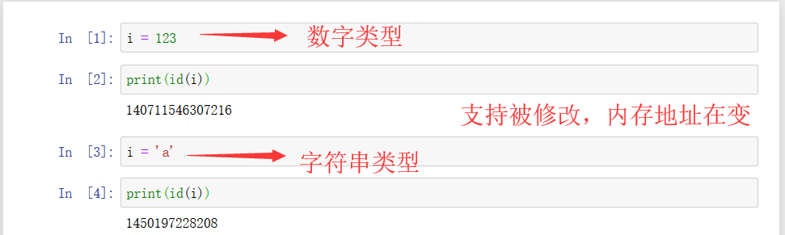

这个图充分说明了Python是一门强类型的动态语言兼解释性语言，主要特性表现在动态性。

&nbsp;

#### 2.变量类型

在Python中一个变量的类型有许多种，在这儿可以划分为基本类型与内置数据结构

- 基本类型
  - int
  - float
  - bool
  - None
- 内置数据结构
  - str
  - list
  - tuple
  - set
  - dict

现在我们重点来讲一下这四个基本类型：

对于数字变量来说，在Python3中，分整型与浮点型，也就是int与float

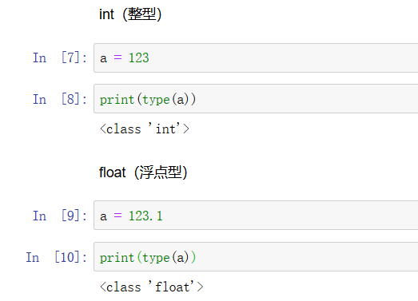

你可以只通过有没有小数点来判断这是整型变量还是浮点型变量。

===================================================

再来说说这个bool变量类型，它的中文叫法是布尔

其实它只有两个值：True和False（对大小写敏感，其他写法都是错的）

这个类型用来判断条件的真假，帮助if语句进一步完善逻辑：

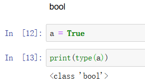

当然了，bool可以自成一个函数方法，用来判断语句是不是真的，但是不能判断等式：

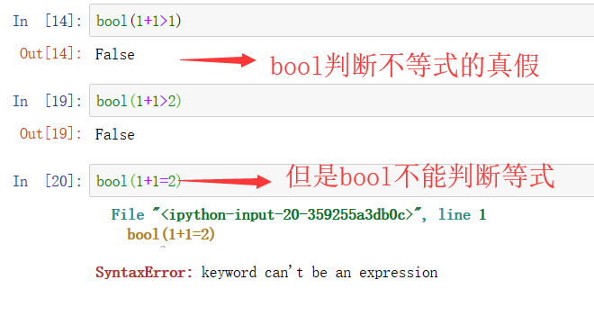

在这儿留个题目，下面哪些变量是bool类型？

```python
a = 'True'
b = 1+2>2
c = 1!=4
d = False
```

===================================================

再来说说最后一种基本类型，None，你的第一印象就是空值的意思

在JavaScript中空值有undefined和null，但是Python的空值只有None

它既不是空字符串也不是未定义，它的作用是等同于你没有定义一个变量但是却使用，就会抛出个None

在布尔判断中，None等同于False的作用，但它不等于False，我想你应该明白这句是什么意思。

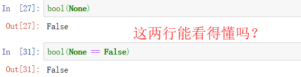

&nbsp;

#### 3.数据结构

在Python中有五大数据结构，我将在下面一一地列出来，帮助你们快速理解。

===================================================

- ##### 字符串str

```python
a = 'Masterpaopao is Handsome.'
b = "Masterpaopao is Handsome."
c = '''Masterpaopao is Handsome.'''
d = """Masterpaopao is Handsome"""
```

现在你应该明白字符串的符号一共有三种：单引号、双引号和三引号(可以分为两种)。

（说一下三引号吧，实际上c和d是没有区别的，侧重点在于三个引号，不重视是什么符号）

其中，单引号与双引号用于字符串变量的赋值，而三引号用于注释或支持换行的说明文字。

现在特意拿出三引号来说明下，支持换行是什么意思：

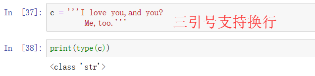

现在再来验证一下这些符号究竟相不相同：

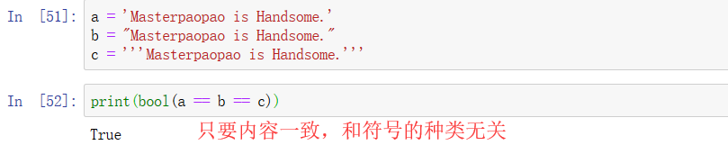

所以，总结出一句话：

字符串的特性是变量是否相同对符号类型不敏感、只有三引号支持换行。

===================================================

- ##### 列表list

```python
a = [1, 2, 3]
b = [1, 1.1, '1.2']
c = ['1', '2', '2']
d = ['1,2', (1,2), [1,2]]
```

你应该明白，列表的标志性符号就是中括号，可以装进无数个对象。

根据这三句分析，Python的列表完全可以容纳下各种不同的数据变量类型对象，

这里面的东西都叫做列表的元素，这些元素可以容纳不同种类型，也可以重复。

我们来验证一下这两个列表是否相同：

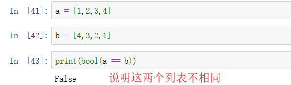

所以，总结出一句话：

列表的特性是中括号、多样性，可重复，有序。

===================================================

- ##### 元组tuple

```python
a = (1, 2, 3, 4)
b = ('1', 2, 3)
c = (1, 2, 2)
d = ('1,2', (1,2), [1,2])
```

我们在学习了上面的列表之后，再来看看这儿的元组，就明白这些具有相似性。

元组与列表的区别是没有元素的说法，不能单独改变里面的一个值。

再来看看验证下是否为有序：

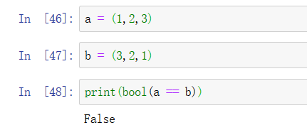

所以，总结出一句话：

元组的特性是小括号、多样性，可重复，有序，不可单独改变元素。

===================================================

- ##### 集合set

```python
a = {1, 3, 4, 7}
b = {'1', 2, 3.3, 4}
c = {(1,2,3), '1,2,3'}
```

集合的标志性符号是大括号，但是你可以发现我这次少了两个对比验证

一个是没有出现重复元素，一个不支持列表和集合的元素

所以我们进一步验证一下这个是否为有序：

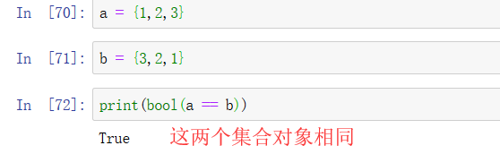

出乎意料的是，这两个变量是相同的，这说明集合里面的元素是无序的。

所以，总结出一句话：

集合的特性是大括号、弱多样性(元素不支持列表与集合)，不可重复，无序。

===================================================

- ##### 字典dict

我敢说，字典才是所有数据结构中的灵魂所在，因为它是一种键值对的结构。

字典的键值对是啥意思？K=V结构，键是冒号前的变量，值是冒号后的值。

```python
a = a = {1:1, 2.0:'2', None:3}
b = {'a':'1,2','b':(1,2),'c':[1,2],'d':{1,2}}
c = {'e':{'f':'fff'}}
d = {True:1,False:2}
```

你一眼望去，是不是觉得字典的多样性非常强？它的值支持任意类型的数据。

先来识别下字典的键：

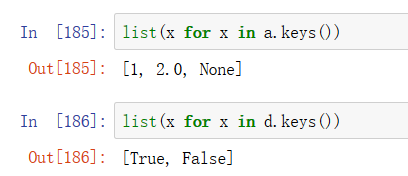

这说明字典的键支持Python的四种基本类型：int，float，bool和None。

最后再来验证一下字典是不是有序的：

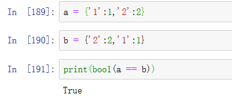

通过这个我们得出一个最强的结论：

字典的特性是大括号、K=V存储结构、超强多样性，键不可重复，无序。

字典这部分肯定要重点掌握,它同样也是数据结构的灵魂，也是后面要学的json的载体。

&nbsp;

#### 4.类型转换

类型的转换毫无疑问是家常便饭，比如你拿到一个3的数据，但是你想转换成字符串形式

这些类型的转换在python中都有内置函数的支持

先来看看一个错误的例子：

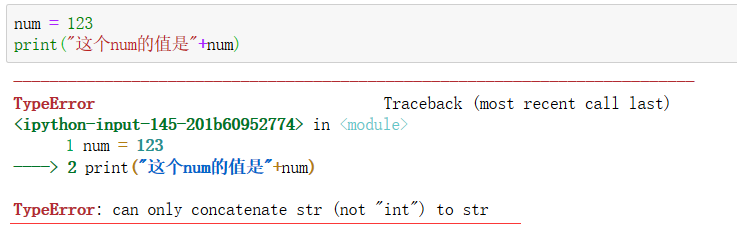

这句话居然打印不出来，一看报错，两者类型不相同，不能直接相加打印。

好呗，那就只能用内置函数str()来转换为字符串类型再相加了：

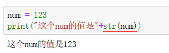

那么，字符串转换为数字呢，也是可以的，有int()与float()两个函数

老规矩，来看看两个错误的例子:

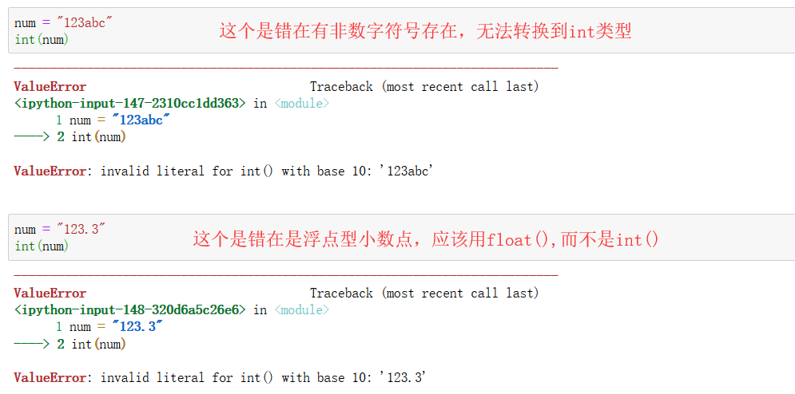

这两个错误应该都看的明白吧？尤其是第二个错误，带小数点的就只能用float()

当然了，这个float要注意，这个可以对字符串的整数所使用：

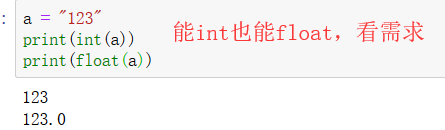

这个完全是看需求来的，是选择int()还是float()。

&nbsp;

在这儿，我要说一句输出print的小技巧，在前面我们只能这样输出

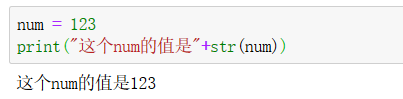

难道每次使用我都要str转换一下吗？这也太麻烦了！

所以我们从现在就要养成一个习惯，学会使用f“{}"的形式来打印：

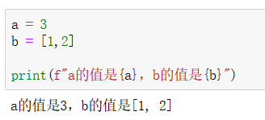

看到了吗，使用这个方法，完全不需要你愁类型的不同，直接f"{}"导入打印就可以。

&nbsp;

#### 5.本章小结

```
int：    整型
float：  浮点型
bool：   布尔型，只有True和False。
str：    字符串，有三种符号，其中三引号可以换行。
tuple：  元组，小括号、多样性，可重复，有序，不可单独改变元素。
list：   列表，中括号、多样性，可重复，有序。
set：    集合，大括号、弱多样性(元素不支持列表与集合)，不可重复，无序。
dict：   字典，括号、K=V存储结构、超强多样性，键不可重复，无序。
```

&nbsp;

## 二.运算程序

#### 1.运算符

假如我是面试官，我一上来就问你一个问题：

“Python一共有几种运算符啊？”

我敢说，大部分求职者肯定懵了，今天我就带你好好捋一捋。

===================================================

- ##### 算术运算符

算术运算符很好理解，无非就是那些加减乘除

```
+	相加
-	相减
*	相乘
/	相除
//	取整
**	求幂
%	取余
```

我这儿说一句废话，这些运算符只能对数字运算，也就是int和float。

你们可以自己下去一个个试，这些都是潜移默化的东西，肯定都会的。

===================================================

- ##### 比较运算符

```
>	大于
<	小于
==	相等
!=	不等
>=	大于等于
<=	小于等于
```

通过上面比较运算符得出的结果都是bool类型的结果，要么为True，要么为False。

===================================================

- ##### 逻辑运算符

```
and	与运算
or	或运算
not	否运算
```

不知道你们的数字逻辑基础好不好，这个应该是一个电路的原理，也就是与门，或门和非门。

这里面的运算是很奇妙的，一般只看第一个就能得出结果，这也是传说中的"短路"。

注意，在逻辑运算符中，被运算的必须是布尔型类型或支持转布尔类型的数据。

首先来看看与运算，两者都为真的时候才返回真，其他都是返回假：

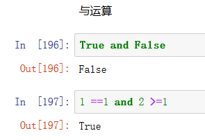

再来看看或运算，两者都为假的时候才返回假，其他都是返回真：

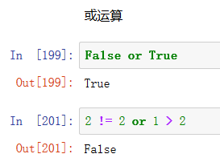

最后的否运算，就很简单了，就是将布尔的值给反向输出

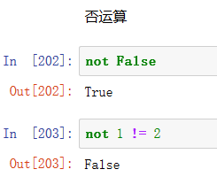

现在，我来说说”短路“的现象吧，这概念是跟数字逻辑的原理有关的

&nbsp;

先看看and的短路情况：

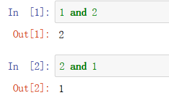

我将1和2交换顺序以后，输出的结果完全不相同，这是因为与运算中，你必须保证两个都为真，所以当电流通过第一个分支判定为真的时候，就会来到第二个分支继续判断，所以最终的结果都是最后面的数字。

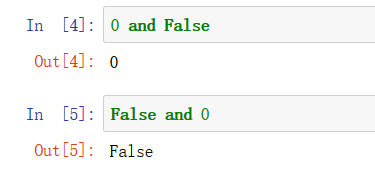

这个图又说明了什么，当你遇到的第一个分支为假的时候，就直接返回最终的结果，这就是与运算的短路现象。

&nbsp;

再来看看or的短路情况：

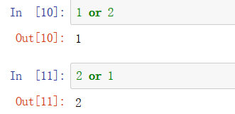

这是或预算，当你遇到的第一个分支为真的时候，就立马返回结果，因为或运算只需要其中一个为真就能判断为真了。

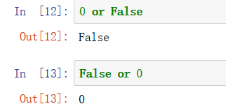

当两个都为假的时候，返回的肯定都是第二分支的结果，与上面的and截然相反的，现在你应该明白我说的这些规律了，你可以把这些想象成一个电路。

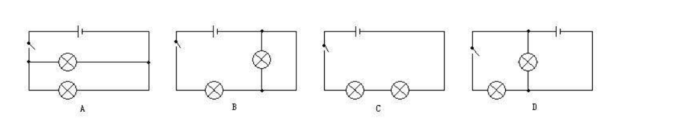

&nbsp;

所以，我们来总结一下这个与运算和或运算中的短路现象吧！

```
and-与运算：
当两个为真的时候，返回第二个被判定的数据
当两个为假的时候，返回第一个被判定的数据

or-或运算：
当两个为真的时候，返回第一个被判定的数据
当两个为假的时候，返回第二个被判定的数据
```

一定要时刻注意这个现象，在使用的时候选择好顺序，返回你所期望的结果！

===================================================

- ##### 成员运算符

```
in	包含
not in	不包含
```

这个运算符的内容很简单，我们可以采用字符串，元组，列表，集合来讲一下：

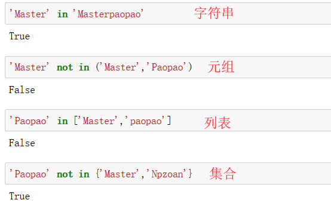

发现了吗，成员运算符可以灵活运用于五大数据结构，不对，还差个字典！

那我们就来试一下字典的成员运算符吧！

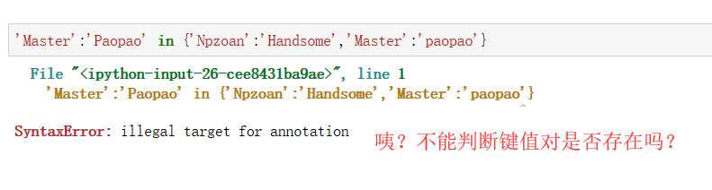
咦？怎么报错了？是这样的，字典里面的成员运算符只针对键存不存在

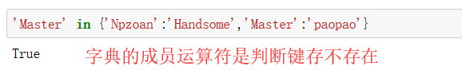

===================================================

- ##### 身份运算符

```
is	同一身份
is not	非同一身份
```

这个与上面的成员运算符类似，又有它的独到之处，这个可以用来判断两个变量是否相等

注意，这儿的相等是指内存地址的相同。

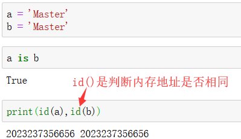

当a='Master'开辟一个内存地址的时候，再创建一个相同的b变量，Python发现这个不是和a变量一样吗，所以就将b变量的内存地址也指向了a，所以两个变量内存地址相同。

至少，这个指向内存地址的原理对字符串有效，但是对其他数据结构就行不通了，具体的可以自己下去试试元组，列表，集合，字典等，开辟一个就是一个内存地址，并不会管你的元素内容相不相同。

实际上，这个应该也对数字有效的，但是却有一定范围的限制，来看看下面的代码：

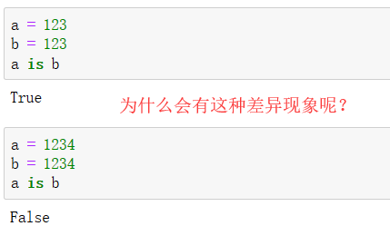

这就要说一下这个底层cpython的解释器运行机制。它为了优化性能，给了一组数字范围，你用到了这里面的数字就直接给定你已经有的内存地址。当你脱离出这组范围使用数字的时候，就会给你开辟一个新的内存地址。

这组数字范围是-5~256。

===================================================

- ##### 位运算符

```
&	按位与
|	按位或
^	按位异或
~	按位取反
<<	按位左移
>>	按位右移
```

位运算符比一般的算术运算符速度要快，而且可以实现一些算术运算符不能实现的功能。

这意味着它的学习成本很高，需要你懂得二进制，原码补码反码的知识。

所以我在这儿只是给出一个概念，你知道有这个东西存在就行。

&nbsp;

我给出一个在Python中你会用到的两个位运算符的应用：

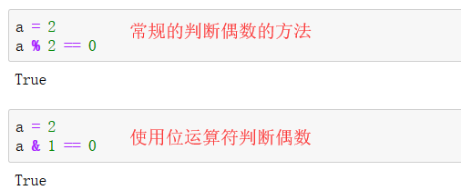

看到了吗，位运算符中的这个&能够判断一个数字还是奇数还是偶数。

原理很简单，一个数字的二进制中最后一位是0还是1就能直接看出来是奇数还是偶数。

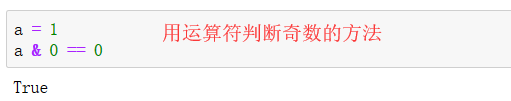

&nbsp;

再来说说最后一个位运算符的应用，这个就很好玩了，如何交换两个变量的值

这个在后端中的方法很常用，所以赶快学习下位运算符提升下性能吧！

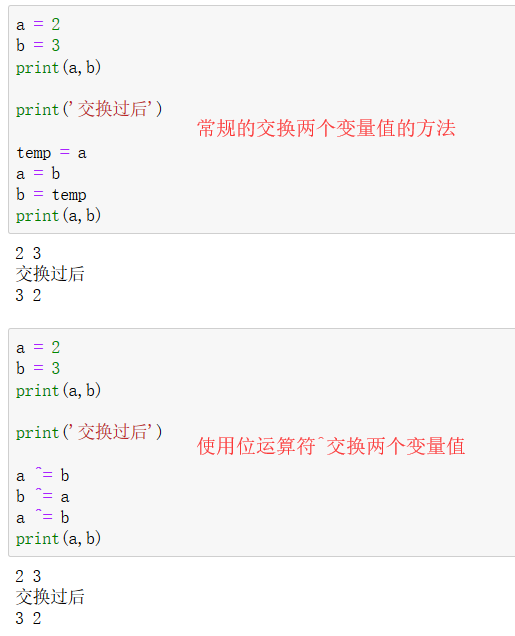

看明白了吗，精华就在于这三句代码：

```
a ^= b
b ^= a
a ^= b
```

这三句代码就完成了两个变量值的交换的过程，至于原理我是真的说不清楚

建议各位亲亲记下笔记，以后直接套用这三句代码就可以了~

===================================================

- ##### 赋值运算符

赋值运算符绝对是使用频率最高的运算符之一，因为它常常配合条件与循环来完成一个程序的逻辑，所以这部分可以好好理解一下，只需要一分钟即可。

```
+=	自增运算
-=	自减运算
*=	自乘运算
/=	自除运算
……
```

事实上，所有的算术运算符都可以被用来赋值运算符，只要你知道怎么用。

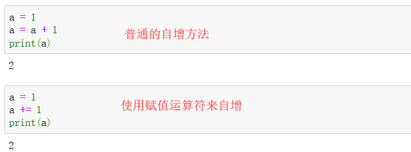

如果你一时难以理解，你就记住一个公式“a += 1    -->   a = a + 1”

然后多用用你就记住了，这个赋值运算符主要在于熟能生巧。

===================================================

现在，你已经学会了Python中的七种运算符，还怕面试官问你吗？

来一张最后的总结图吧！

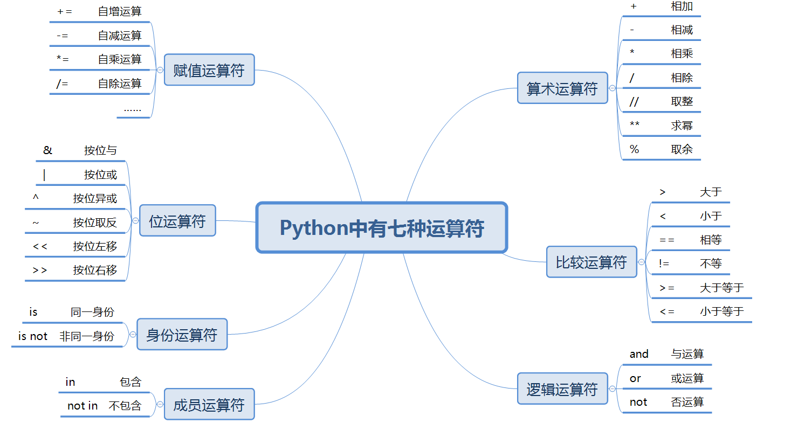

&nbsp;

#### 2.基本功

一个Python程序员的基本功到底是什么，不对，是所有编程语言的程序员的基本功是什么

这个基本功当之无愧的是条件与循环，它打造了程序逻辑的大半个江山。

在这个地方我会分为五个部分来讲解基本功

```
bool	学会判断条件的真假
if/elif/else	条件判断语句
for	循环语句
while	循环判断语句
continue/break	循环中的行为
```

===================================================

- ##### bool

为什么要在讲基本功之前，要再讲一遍bool呢？

因为在下面的条件与循环的学习中，我们常常要判断条件表达式的真假

先来看看下面的图，判断列表为真为假的情况：

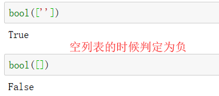

在你开发的过程中，你常常会判断一个数据结构是否为空来进行是否下一步的操作

在上面的代码中，虽然这个元素是空的，但它毕竟算一个元素，自然是判定为真

再来看看字符串的判断：

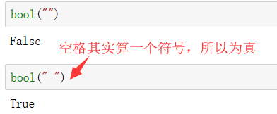

千万不要被空格迷惑了，空格实际上等同于一个符号，算是有内容的东西哦！

&nbsp;

在这儿，我整理了一个表格，帮助你快速进行条件判断

| 数据类型            | 结果                                          |
| ------------------- | --------------------------------------------- |
| 字符串String        | 空字符串解析为False，有内容(包括空格)就为True |
| 数字Int与Float      | 只有0解析为False，其他都是True                |
| 布尔Bool            | 可以判断那些能被转换为bool结果的不等式，如1>2 |
| Tuple/List/Set/Dict | 没有元素就直接解析成False                     |
| 变量或对象Object    | 这个变量或对象只要存在就返回True              |

聪明的你应该看得懂这个表格，当你看懂了之后，你就可以玩转if判断了。

===================================================

- ##### if/elif/else

①当你只判断一个东西关注一个结果的时候，只用if语句

比如你想判断这个列表到底是不是空列表：

```python
list_one = ['one']

if list_one:
    print('这个list_one列表不是空的！')
```

使用if语句要注意，被判断的地方不需要加括号，然后就是使用英文冒号，再按回车的时候应该会自动产生一个缩进，这个缩进是四个空格，属于强制性的，所以要遵守代码规范。

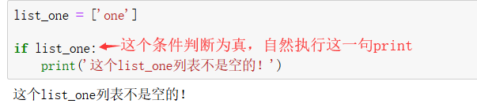

如果这个条件是假的时候，会怎么样？当然是跳过这个print不执行啦！

```python
list_two = []

if list_two:
    print('我这句能被打印算我输')
```

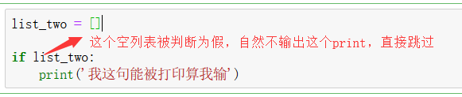

现在你应该明白，if语句无非是判断真假来决定执不执行下面代码的行为。

&nbsp;

②当你判断一个东西关注两个结果的时候，用if/else语句

虽然我介绍了上面的if，但是事实上标准的用法应该是if/else，让你的代码更为严肃，但是一般不喜欢告诉你出错的人就会使用上面的单if语句，假装什么都没发生，不行就是不行。

这次我们使用分数来判断你是否能上清华大学：

```python
score = 630

if score > 650:
    print('恭喜你被清华录取了。')
else:
    print("对不起，你还不够格。")
```

注意，你的if与else必须处于同一个缩进，换句话说，这两个单词在一条竖直的线。

为什么这个else不需要写条件，不知道你懂不懂交集与并集的概念，你可以将整个条件作为整个集合，if条件占据了score>650的部分，那么else就是剩余的所有部分，为score<=650，所以不需要写条件的，直接冒号回车缩进写print就完事。

好了，来看看最终的结果吧，答案很明显，这哥们上不了清华：

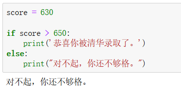

说一下if与if/esle这两种到底有什么区别，前者只关注一种结果，有就给你反馈，没有就啥话也不说。后者则有两种结果，能够让看到的人知道自己被判断的结果是什么。

&nbsp;

③当你判断多种东西关注多种结果的时候，用if/elif/else语句

这个虽然是判断三种条件的语句，但是你如果想判断三个以上的条件呢？

公式就会变成if/elif/……/elif/else，用法都是一样的

这个elif其实是其他编程语言的else if，在Python被简化成一个单词了。

我们还是使用高考的例子来讲吧：

```python
score = 450


if score > 520:
    print("这位同学能上一本")
elif score > 450:
    print("这位同学能上二本")
elif score > 380:
    print("这位同学能上专科")
else:
    print("这位同学上不了大学")
```

这个就是多种条件的判断方式，最后你可以看出来这位同学只能上专科，因为刚好卡在450分

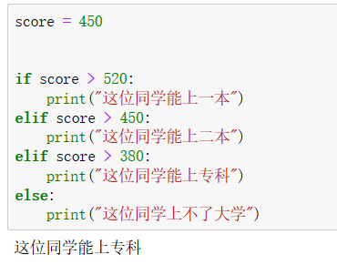

但是你写条件的时候，可千万不能写成这个样子：

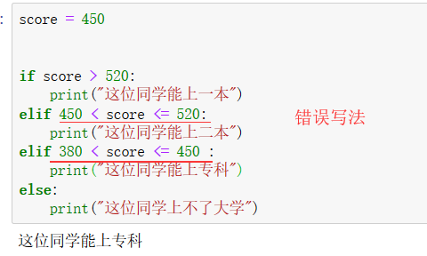

这样写法虽然能行得通，但是完全没任何必要，因为Python是按顺序判断的，它在判断的过程中会自动排除掉一部分又一部分的条件，直到符合条件为止。

现在，你已经学会了if/elif/else，你可以进行大量的练习来巩固，也可以继续往下看，因为本章讲解的基本功都是互相联系分不开的，最后再进行混合练习也无妨。

===================================================

- ##### for

for，就是一个循环干活的语句，循环的本质就是遍历集合中的元素，先来看看下面的例子

```python
score_list = [630,591,555,700]

for score in score_list:
    print(score)
```

for……in……将会成为你最常用的遍历手段，这是从数据结构依次拿出单个元素，直到你拿出来全部的元素，这个for循环就结束的意思。

这句代码是什么意思呢，就是遍历这个score_list列表，然后依次拿出来打印，在这个过程中，你需要给每个拿出来的数据取个名字，这个名字就是score，每次循环，它的值都会指向新的元素。

输出的结果，很显然，print属于块级换行输出，所以输出是这样的：

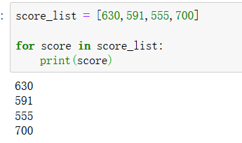

当然了，有人觉得这样输出不好看，希望输出到一行，你其实可以改动print参数

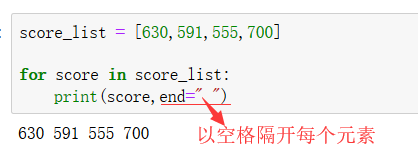

这个就是最直观的for用法，无非是循环拿出来列表里的每一个元素。

当然了，你肯定对字典感兴趣，想知道for循环怎么结合字典来使用：

```python
score_dict = {"Master":555,"Paopao":666,"Npzoan":690}

for name,score in score_dict.items():
    print("这位"+name+"同学高考考了"+str(score)+"分")
```

说一下这个items()函数，属于python的内置函数，用来处理字典的键值对，将它们输出成一种特殊的dict_items的元组存储形式，用来方便被for进行遍历

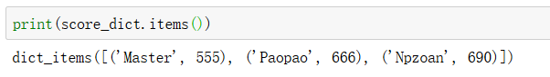

你只需要知道items的作用就可以了，理解成一种能被for循环的数据结构也没问题

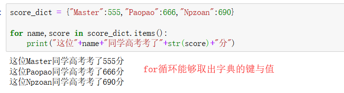

如果你看不懂，没关系，只要你明白这段程序是什么意思就可以了，for循环同样能够取出字典的键值对进行操作就可以了。

&nbsp;

当然了，我们绝对不能忘记range()函数，可以说是专门为for循环而生的一个内置函数。

这个函数你可以理解为自动创建一个列表的函数，不妨看我这个图了解：

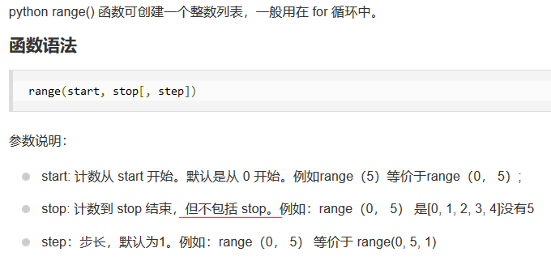

所以你可以提炼出一个重要的信息，这是一个前闭后开的函数，比如range(0,2)就是[0,1]

再来看看下面这一段粗暴的例子:

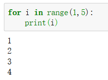

range(1,5)就等同于[1,2,3,4]，现在你应该明白range()怎么用了吧，是不是非常简单。

现在我们的range()还有个快速的应用，就是求某段数字范围内的奇数或偶数：

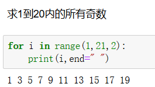

在上面第一张图中你也看到了，第三个参数就叫做步长step，range(0,5)就等同于range(0,5,1)，只有1个步长，代表一个数据走到下一个数据需要走1步，步长就是这么理解的。

所以我求1到20内的奇数，步长设置2就行了，这意味着一个奇数走两步就到下一个奇数。

===================================================

- ##### while

while同样也是循环，可是它与for的区别到底是哪？

while是带着条件判断去循环的，在这其中会遇到赋值运算符，还是上一段代码吧！

```python
count = 5

while count > 0 :
    print("现在的数字是"+str(count))
    count -=  1
```

这段程序是什么意思，就是首先对循环的条件进行判断，发现count满足，就进入while下面的代码开始执行，在执行完代码的时候，必须完成自减运算，让count减一回到开头，否则这个循环永不刹车的，凭电脑的计算速度，小心让你的电脑崩溃！


事实上，while还能与if相结合使用，也就是在循环的途中进行条件判断

```python
day = 1
print("上头命令在5天之内抓到犯罪嫌疑人")

name_list = ["whaha","miao","wheehei","Master","Hahaa"]
print("这是犯罪嫌疑人名单，每天审讯一个吧！")

    
while name_list:
    if day == 5:
        print("\n混账，现在是最后一天了！")
    print(f"现在是第{day}天")
    name = name_list.pop()
    print(f"正在审问{name}中……")
    if name == "whaha":
        print("终于抓到你了，犯罪嫌疑人就是你！")
    day += 1
```

你可以仔细看这段代码，这段代码是怎么发挥作用的，怎么将if与while结合的

这个是在五天之内必须找到犯罪嫌疑人的故事，在最后一天截至的时候，终于找到了。


当然了，代码里面的pop()函数我们会在后面讲到，你可能不明白这个while是怎么终止的，这个pop()函数会将列表里面的元素弹出去，当全部弹出去之后就成了空列表，自然就停止循环。

你可以仔细品味一下这段程序，确保你弄懂了while怎么用，还知道怎么与if结合。

现在我们来看看循环中的continue和break两个重要的参数。

===================================================

- ##### continue/break

如果一个循环，只能让它完整地循环，而你不能做什么，那该多么无趣

所以我们对for与while这两种循环都设有了continue与break，注意，这两个只能在循环使用。

①continue

终止本次循环的执行,接着进行下一次循环条件的判断。

也就是说，一旦碰到continue，就无视循环体内剩下的代码，回到循环体的开头。

来一段代码，帮助你理解一下continue的作用：

```python
num_list = [1,2,3,4,5,6]

for num in num_list:
    if num == 4:
        print("我觉得这个数字不吉利，不想求幂")
        continue
        
    print(num,num**2)
```

这是什么意思呢？从一个数字列表拿出来每个元素，进行求幂并打印，但是这位写程序的人嫌弃4数字不吉利，甚至都不想打印出这个4，所以直接跳过了打印，来到了下一个数字。


这个例子应该通俗易懂，你可以拿掉这个continue来对比一下，一下子秒懂


&nbsp;

②break

一旦触碰到break，停止循环，直接跳过循环的全部代码，进入循环下面的代码执行。

我们可以直接拿上面的抓捕犯罪嫌疑人的 例子，假如我们第二天就抓到了犯罪嫌疑人，那么下面五个还需要审问吗？所以这个时候需要上个break终止一下循环：


这个例子够直接粗暴吗？如果你还是看不懂，我还是写个简单例子说明一下吧：

```python
count = 1

while count > 0:
    
    if count > 10:
        break
        
    print(count)
    count+=1
```

这个程序还看不懂我就没办法了！


总之，灵活运用continue和break能够更好地约束循环中的行为，接下来我们会接触input函数与异常处理来写更加完善的循环程序，练习多的是！

&nbsp;

#### 3.来输入

在上面，我们给定的变量都是固定的，这会不会让编程变得生动无趣。

所以我们需要input()函数，通过键盘来与程序进行交互。

首先先来了解一下我们输入的东西到底是什么：

```python
result = input("请输入你喜欢的一个数字：")
print(result)
print(type(result))
```

当这个程序运行的时候，它会弹出个输入栏让你输入数字，输完按回车即可。


发现了吗？最终的结果居然是字符串形式的！

请记住：input()函数的结果其实是你键盘输入的数据以字符串的形式赋值给你设置的变量。

这下就得出一个重要的结论，你input输入的任何东西都是字符串形式的，如果你需要处理这个数据的话，需要先转换一下类型！

现在，我们就写一个简单的求幂程序，主要是向你们展示类型转换的关键之处：


&nbsp;

你可以用input()去做很有意思的事情，可以完成一些有意思的交互，正好我也想借助input()函数再跟你们复习一下上面所学到的基本功内容。

写个input()+while+if相结合的程序吧，融会贯通才是最好的学习方式：

```python
while True:
    text = input("有什么想对倒叙复读机说的吗？")
    
    if text.lower() == "quit":
        print("对话结束")
        break
        
    print(f"你说-->{text}")
    print(f"我说-->{text[::-1]}\n")
```

这段程序干货非常多，有三个重要的知识点：

一个是while True，代表循环永动机，不出意外的话它会一直循环下去。

另一个是lower()函数，它负责将一个字符串的所有字母内容变成小写。

最后一个就是[::-1]，这个操作叫做倒序切片，负责将字符串的内容进行反转，我们会在后面的内容中讲解切片。其余的部分你们应该看得懂了：

这就是一个循环聊天器，机器人会将你说的话进行倒序复读，当你不想聊天的时候，你可以输入quit来结束对话，完美融合了while+if+input()+break等多方面知识。


但是你心里会明白，你必须考虑到异常输入的情况，不可能所有的输入都是符合规范的，总有输入会引起程序异常，这就是下一个小节要讲的内容。

&nbsp;

#### 4.刚异常

再来回顾一下上面写的输入程序：

```python
num = input("请输入一个你要求幂的数字：")
print(f"{num}求幂后的结果是{int(num)**2}")
```

就这段程序，没有任何异常处理，我有两种方式让这个程序崩溃，你信吗？


看到了吗，一切的源泉都是因为那个int(num)，这个地方你只能输入int类型的数据，不然就会导致程序异常中止，所以我们应该怎么解决这两个BUG呢？

首先，先解决输入float的问题，这个并不算异常，因为float数字也能求幂，所以直接上if/else设置两个分支就可以了。

但是，写程序之前，我们遇到了一个难题：


现在，你已经知道了强大的eval()函数。它的功能类似于脱掉字符串的外衣，OK，写代码！

```python
num = input("请输入一个你要求幂的数字：")
if type(eval(num)) == int:
    print(f"{num}求幂后的结果是{int(num)**2}")
else:
    print(f"{num}求幂后的结果是{float(num)**2}")
```

这样是不是就很简单了~~，随便输入点小数点，结果是没任何问题的：


现在，我们来解决最有一个问题，输入字符的问题，这个是没办法解决的，你一个字符怎么求幂？所以，这个时候，我们的异常处理模块就登场了。


其实异常处理模块有很多种写法，但是我只采用着这种最终标准的写法，属于万金油。

我会来一段经典地异常处理模块代码，让你快速上手：

```python
name_list = ["Master","Npzoan","Paopao"]
try:
    print(name_list[3])
except Exception as e:
    print("报错的内容如下：",e)
    print("你查询的似乎超出了列表的索引")
```

你可以很明显地看出来，try里面的代码是错误的，因为我这个name_list列表的索引分别是0,1,2，最大的索引值是2，而这个3是不存在的，必然报错。所以except里面的第一句print，变量e（Exception as e的意思就是给报错的变量起个别名为e）打印出Python的报错，第二句print是自己自定义的报错语句，所以最终的结果是这样的：


如果你还是看不懂异常处理模块怎么用，虽然我的教程面向于已经学过Python的人，但是不乏有些初学者会浏览我这个博客，我的建议是你可以上菜鸟教程学习一下，熟悉一下这个原理就行。

现在，让我们最开始的代码，使用异常处理进行改正吧！

```python
num = input("请输入一个你要求幂的数字：")
try:
    if type(eval(num)) == int:
        print(f"{num}求幂后的结果是{int(num)**2}")
    else:
        print(f"{num}求幂后的结果是{float(num)**2}")
except Exception as e:
    print("\n看看报错的内容是什么：",e)
    print("小老弟，这个程序只能输入int或folat的数据噢")
```

现在，你应该看得懂了吧？现在这个程序已经变成了成熟的程序，不管你输入什么都不会再引起程序异常终止，这便是异常处理的魅力。


&nbsp;

#### 5.看输出

现在，我们已经讲完了python基础的一半，当我写到这儿的时候，我意识到我没有好好地讲一下print()的内容，实际上，对于字符串与变量的混合输出方式，一共有五种，我逐一介绍一下：

1）使用逗号输出

print("第一种输出",e,"的方式")


可以知道这种方式，逗号会带来一个空格的分隔。

===================================================

2）使用加号输出

print("第二种输出"+e+"的方式")


加号输出的方式不会带来空格的问题，但是缺点：如果是数字，需要改变类型。

===================================================

3）使用f"{}"输出


这种方式我推荐大家重点使用，因为不需要考虑数据类型。

===================================================

4）使用{}.format()输出


这样也可以，相比较第三种方法是繁琐了点，如果你要用多个变量，就这样写：


空大括号的顺序是有讲究的，是根据format里的参数来。

===================================================

5）使用%格式化输出

如果你对变量的类型的区分有要求，可以使用%s与%d，分别是字符串与数字


与format的用法是类似的，这个格式化输出的方式严格控制变量类型，也是可以使用的。

&nbsp;

#### 6.写作业

好了，你已经看到了这儿，这意味着你学完了程序的基本功，知道怎么编写条件与循环，知道怎么用input()函数与程序交互，还知道怎么用异常处理模块完善程序，现在的你，已经有能力编写一个成熟的程序了。

这儿给你奉上的是两张总结图：

①复习下运算符


②Python的基本功


现在即将出场的是 ，两份热乎乎的作业，我希望大家都能自觉完成。

第一份作业：打印出9x9乘法表口诀，作业效果如下：


第二份作业，就很难了，这也是培养你百度的能力，打印出斐波那契数列。

&nbsp;

## 三.数据结构

#### 1.开场白

不知道有一个年度最佳微小说你们有没有看过：


其实我也是这样的，我写着写着，就失去了初心，因为本来我这篇博客就是面向已经学过python的人，但是我写着写着，又不小心写的很详细，又成了个小白入门教程。

矛盾在于我也有我自己的时间，我需要加快我复习的步伐，因为前方等着我的是Django的学习，SQL的强化和数据结构与算法的学习，我的时间很紧，我也要备战秋招。

所以我的教程即将更换风格，全心全意地写总结式教学了，在后面你将看不到详细的解释，取而代之的是各种函数方法的用法总结。

如果你是小白，你学到了这儿，我只能提醒你，你还需要去了解变量的命名规则，缩进是什么，代码的风格是怎么样的，这些都能帮助你编写更加规范的Python程序。

现在，往下的内容你将看到五大数据结构的函数用法汇总，请敬请阅读！

&nbsp;

#### 2.字符串

怎么操作字符串，在学习之前必须要有个清晰的思维，就是从增删改查四个角度去学习。

但是我们是有基础的人，所以要往深度拓展，所以我接下来的教学将会分下面八个部分：

- 增·
- 删
- 改
- 查
- join
- split
- 转义
- 判断

接下来就看好了，我的表演时间到了。

===================================================

- ##### 增

```
# 1 - 直接相加
"Welcome" + "you" + "!"

# 2 - 格式化
"I'm %d years old."%20

# 3 - 使用format
"{} loves {}.".format("Master","Paopao")

# 4 - f"{}",重点使用
age = 20
f"The beautiful girl is {age} years old,too."
```

这些知识，在上面的print()输出我们就已经接触过了，再复习下也好


===================================================

- ##### 删

字符串的删，实际上是删不掉的，因为你已经创造出来这个变量了

所以这儿的删，是直接赋值空字符串，清空内容


===================================================

- ##### 改

```
replace()	替换内容
upper(),lower(),title(),swapcase()	改变大小写
lstrip(),rstrip(),strip()	删除空白
zfill(),ljust(),rjust(),center()	填充长度
```

现在，我会将代码和结果全部放在一个文本框，以----为分割线。

&nbsp;

使用replace()替换掉所有的@成空字符串，达到删除的目的

```python
str = "Ma@ster@Pao@pa@o"
new_str = str.replace("@","")
print(new_str)
----
Masterpaopao
```

使用upper()让所有字母变成大写

```python
str = "Masterpaopao666"
new_str = str.upper()
print(new_str)
----
MASTERPAOPAO666
```

使用lower()让所有字母变成小写

```python
str = "MasterPAOPAO"
new_str = str.lower()
print(new_str)
----
masterpaopao
```

使用title()让所有的单词首字母变成大写，其他均小写

```python
str = "Master LOVE paoPAO"
new_str = str.title()
print(new_str)
----
Master Love Paopao
```

使用swapcase()可以让所有的大小写反转

```python
str = "MaSTer"
new_str = str.swapcase()
print(new_str)
----
mAstER
```

使用lstrip()删除字符串左侧的空白

```python
str = "  Master  "
new_str = str.lstrip()
print("|"+new_str+"|")
----
|Master  |
```

使用rstrip()删除字符串右侧的空白

```python
str = "  Master  "
new_str = str.rstrip()
print("|"+new_str+"|")
----
|  Master|
```

使用strip()删除字符串左右侧的所有空白

```python
str = "  Master  "
new_str = str.strip()
print("|"+new_str+"|")
----
|Master|
```

当然了，strip()还能删除你不喜欢的内容，但是只能删除处于首和尾的内容

```python
str = "Master666"
new_str = str.strip("666")
print(new_str)
---
Master
```

zfill()是个特殊的填充方法，参数指定长度，不够的就在左边填充0，专门用于二进制

```python
num = "110110"
new_num = num.zfill(16)
print(new_num)
----
0000000000110110
```

使用ljust()填充内容，可以自己选择填充符号，虽然是l，但向右填充

```python
str = "救救我"
new_str = str.ljust(10,'!')
print(new_str)
----
救救我!!!!!!!
```

使用rjust()填充内容，可以自己选择填充符号，虽然是r，但向左填充

```python
str = "注释大军"
new_str = str.rjust(10,'#')
print(new_str)
----
######注释大军
```

使用center()能够将字符串内容置中，指定填充符号与长度

```python
str = "分割线"
new_str = str.center(20,'-')
print(new_str)
----
--------分割线---------
```

目前大概总结一下，就是这么多：


===================================================

- ##### 查

```
find()	正序查找字符就返回正序索引值，找不到就返回-1
rfind()	倒序查找字符就返回正序索引值，找不到就返回-1
index()	正序查找，功能类似find()，找不到就抛出异常
rindex()	倒序查找，功能类似rfind()，找不到就抛出异常
count()	计算指定字符的个数，如果没有就返回0
```

特地说明一下，index()的功能与find()没区别，区别在于index会抛出异常终止程序

至于这个rfind()，虽然是从右往左查找，但是如果找到了，返回的结果依然是正序的索引位置。

再说明一遍，只以找到的第一个符合条件的位置为返回结果。

&nbsp;

我们可以使用find()在字符串中寻找指定的字符

```

```


===================================================

- ##### join

===================================================

- ##### split

===================================================

- ##### 转义

===================================================

- ##### 判断

===================================================

- ##### 最终总结


#### 3.列表


#### 4.切片


#### 5.元组


#### 6.集合


#### 7.字典


#### 8.总结


## 四.迭代器


